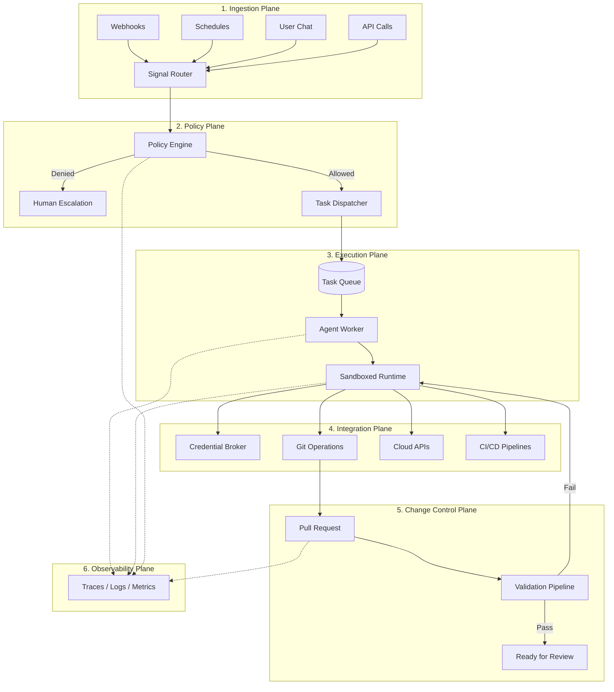
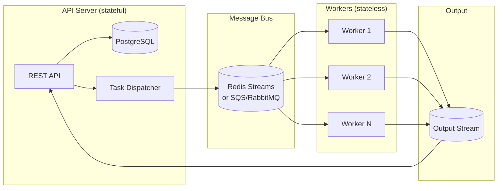
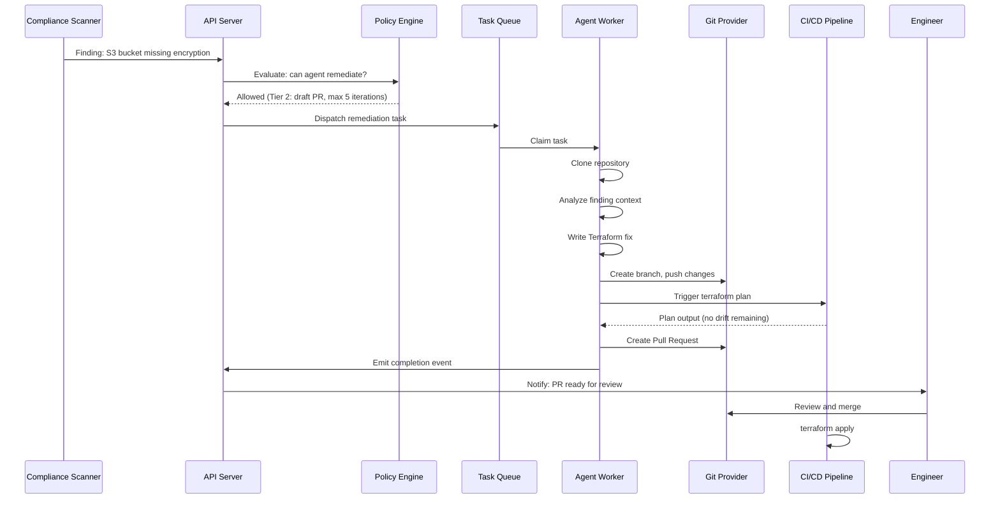

# Chapter 1: Architecture Overview

> The six planes of a production infrastructure agent system.

---

## The Big Picture

An infrastructure agent system isn't just "an LLM with tools." It's a distributed system where untrusted language model output drives privileged infrastructure operations. Getting the architecture right is the difference between a productivity multiplier and an incident generator.

A robust architecture separates into **six interacting planes**:



---

## Plane 1: Ingestion

How work enters the system. Infrastructure agents respond to multiple signal types:

| Signal Source | Example | Trigger Type |
|--------------|---------|-------------|
| Webhooks | GitHub PR opened, compliance finding created | Event-driven |
| Schedules | Daily drift scan, weekly compliance check | Time-driven |
| User chat | "Fix this S3 bucket policy" | Interactive |
| API calls | CI/CD pipeline triggers agent review | Programmatic |
| Alerts | PagerDuty incident, CloudWatch alarm | Reactive |

### Architecture Pattern: Signal Router

```typescript
// All signals normalize into a common dispatch format
interface AgentTask {
  type: 'compliance-remediation' | 'drift-detection' | 'pr-review' | 'chat';
  trigger: {
    source: 'webhook' | 'schedule' | 'user' | 'api' | 'alert';
    sourceId: string;         // PR number, finding ID, etc.
    timestamp: string;
  };
  context: {
    organizationId: string;
    repositoryId?: string;
    agentSlug: string;        // Which agent handles this
    priority: 'low' | 'normal' | 'high' | 'critical';
  };
  payload: Record<string, unknown>;  // Agent-specific data
}
```

### Alternatives for Signal Ingestion

| Approach | Good For | Watch Out For |
|----------|----------|--------------|
| **Express/Fastify webhooks** | Simple, direct, easy to debug | Single point of failure; need retry handling |
| **AWS API Gateway + Lambda** | Serverless, auto-scaling | Cold starts; complex local dev |
| **Azure Event Grid** | Native Azure webhook routing | Vendor lock-in |
| **Temporal workflows** | Complex multi-step triggers | Operational overhead |

---

## Plane 2: Policy

The policy plane is **the most important plane** in your architecture. It decides what agents are allowed to do before they do it.

### Core Concept: Autonomy Tiers

Not all actions carry equal risk. Define tiers and bind each to explicit permissions:

```
┌─────────────────────────────────────────────────────────────┐
│  Tier 0: OBSERVE           Read-only. Summarize, analyze.   │
│  ─────────────────────────────────────────────────────────  │
│  Tier 1: RECOMMEND         Suggest changes. No execution.   │
│  ─────────────────────────────────────────────────────────  │
│  Tier 2: DRAFT             Create PRs. No merge/apply.      │
│  ─────────────────────────────────────────────────────────  │
│  Tier 3: SANDBOX EXECUTE   Run in isolated environment.     │
│  ─────────────────────────────────────────────────────────  │
│  Tier 4: PROD WITH GATES   Execute in prod with approvals.  │
└─────────────────────────────────────────────────────────────┘
```

### Policy Engine Pattern

```typescript
interface PolicyDecision {
  allowed: boolean;
  tier: 0 | 1 | 2 | 3 | 4;
  reason: string;
  requiredApprovals?: string[];   // Human approvers needed
  constraints?: {
    maxIterations?: number;       // Prevent runaway loops
    timeoutMs?: number;           // Hard time limit
    allowedTools?: string[];      // Tool whitelist
    deniedTools?: string[];       // Tool blacklist
    requiresPR?: boolean;         // Must produce a PR
    requiresValidation?: boolean; // Must pass CI before PR
  };
}

function evaluatePolicy(
  task: AgentTask,
  orgPolicies: Policy[],
  agentConfig: AgentConfig
): PolicyDecision {
  // 1. Check org-level policies (e.g., "no prod changes without approval")
  // 2. Check agent-level constraints (e.g., max turns, allowed tools)
  // 3. Check resource-level rules (e.g., "production namespace = Tier 4")
  // 4. Return composite decision with most restrictive constraints
}
```

### Policy Sources

Policies can come from multiple places, merged at evaluation time:

```typescript
// Policy digest: consolidated rules injected into agent context
interface PolicyDigest {
  organizationPolicies: string[];    // "Never modify production directly"
  agentHardRules: string[];          // "Max 10 drift iterations"
  repositoryConventions: string[];   // "Use modules/ for shared code"
  complianceFrameworks: string[];    // "SOC2: require encryption at rest"
}
```

---

## Plane 3: Execution

Where agents actually run. The critical architectural rule:

> **Workers are stateless and never touch the database directly.**

This separation means workers can run anywhere — Docker, Modal, Azure Container Apps, Lambda — and crash without corrupting state.

### Reference Architecture



### Why Database Isolation Matters

| If worker touches DB directly... | With DB isolation... |
|----------------------------------|---------------------|
| Worker crash can leave inconsistent state | Events are atomic; server reconciles |
| Need DB credentials in worker environment | Workers only need queue credentials |
| Scaling workers = scaling DB connections | Queue absorbs load |
| Testing requires full DB setup | Workers can be tested with mock queues |

### Alternatives for Task Queuing

| Technology | Strengths | Weaknesses | Best For |
|-----------|-----------|------------|----------|
| **Redis Streams** | Fast, consumer groups, message persistence, built-in backpressure | Data loss risk if not persisted; memory-bound | Real-time, low-latency dispatch |
| **BullMQ** (Redis-backed) | Rich job features (retry, delay, priority), Node.js native | Tied to Redis and Node.js | Node.js-centric architectures |
| **AWS SQS + Lambda** | Serverless, scales to zero, dead-letter queues | 256KB message limit; eventual consistency | AWS-native, bursty workloads |
| **RabbitMQ** | Flexible routing, mature, battle-tested | Operational overhead; clustering is complex | Complex routing needs |
| **Temporal** | Durable workflows, built-in retry/timeout, replay | Heavy runtime; learning curve | Long-running, multi-step agent workflows |
| **PostgreSQL SKIP LOCKED** | No extra infra; ACID guarantees | Polling-based; no pub/sub; limited throughput | Small-scale, single-DB architectures |

---

## Plane 4: Integration

How agents interact with external systems (cloud providers, git, CI/CD). The key principle:

> **The agent never holds credentials. It requests them just-in-time from a credential broker.**

See [Chapter 5: Credential Management](./05-credential-management.md) for the full pattern.

### Integration Points

```
Agent Worker
  ├── Git Operations (clone, branch, commit, push, PR)
  ├── Cloud APIs (AWS/Azure/GCP via short-lived tokens)
  ├── CI/CD Pipelines (trigger plan/validate, poll results)
  ├── Compliance Scanners (Prowler, Checkov, custom)
  └── Communication (Slack, Teams, email for notifications)
```

---

## Plane 5: Change Control

Every agent action that modifies infrastructure goes through the same change pipeline as human changes. See [Chapter 6: Change Control & GitOps](./06-change-control.md).

### The Golden Rule

```
Agent writes code → Agent creates PR → CI validates → Human reviews → CI applies
```

**Never**:
```
Agent writes code → Agent applies directly to production
```

---

## Plane 6: Observability

Agent actions must be at least as observable as human actions. In practice, they should be *more* observable because agent reasoning is opaque. See [Chapter 8: Observability](./08-observability.md).

### What to Observe

| Layer | What to Capture | Why |
|-------|----------------|-----|
| **Agent decisions** | Tool calls, reasoning steps, plan generation | Debug incorrect actions |
| **Policy evaluations** | What was allowed/denied, which rules applied | Audit compliance |
| **Credential usage** | Token minting, scope, expiry, actual API calls made | Security audit trail |
| **Infrastructure changes** | Diffs, PR links, pipeline results | Change attribution |
| **Performance** | Latency, token usage, queue depth, error rates | Cost and reliability |

---

## Putting It Together: End-to-End Flow

Here's a complete flow for a compliance remediation:



---

## Next Chapter

[Chapter 2: Agent Runtime & Orchestration →](./02-agent-runtime.md)
