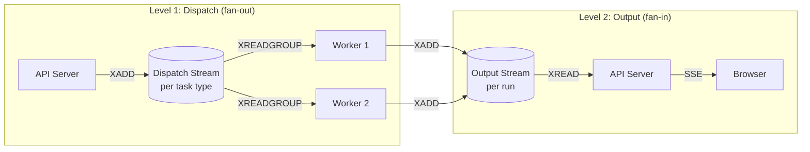
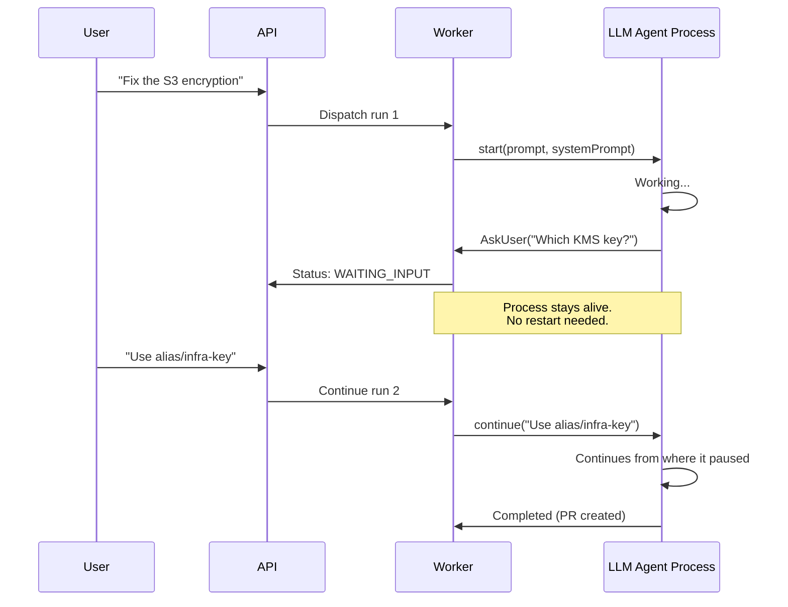
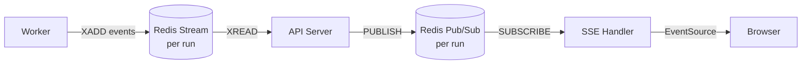

# Chapter 2: Agent Runtime & Orchestration

> Choosing an LLM runtime, task queuing, worker isolation, consumer groups, and recovery.

---

## The Core Problem

An infrastructure agent isn't a simple request-response API call. It's a **long-running, stateful, multi-step process** that:

- Can run for minutes to hours (waiting for CI pipelines, human approval)
- Uses expensive LLM tokens and cloud API calls
- Must survive worker crashes and restarts
- May need to pause and resume (human-in-the-loop)
- Must not interfere with other concurrent agents

This chapter covers two layers: the **agent runtime** (what drives the LLM loop inside the worker) and the **orchestration layer** (how tasks get dispatched, queued, and recovered).

---

## Choosing an Agent Runtime

The agent runtime is the inner loop that drives everything:

```
prompt → LLM → tool_use → execute tool → result → LLM → tool_use → ... → final answer
```

This loop needs to handle tool registration, token counting, error recovery, multi-turn context, and stopping conditions. You can build it yourself or use a framework that manages it for you.

### Option 1: Anthropic Claude Agent SDK

The [Claude Agent SDK](https://github.com/anthropics/claude-agent-sdk-typescript) (`@anthropic-ai/claude-agent-sdk`) is Anthropic's official runtime for building agents on Claude. It's the same engine that powers Claude Code. Available in TypeScript and Python.

The SDK manages the full agentic loop: Claude reasons, calls tools, reads results, and continues until the task is done. You control which tools are available, set budget limits, and stream events in real-time.

```typescript
import { query, tool, createSdkMcpServer } from "@anthropic-ai/claude-agent-sdk";
import { z } from "zod";

// Define a custom tool
const runTerraformPlan = tool(
  "terraform_plan",
  "Run terraform plan in the given directory",
  { workDir: z.string().describe("Working directory path") },
  async ({ workDir }) => {
    const result = await exec("terraform plan -json -no-color", { cwd: workDir });
    return { content: [{ type: "text", text: result.stdout }] };
  }
);

// Create an in-process MCP server for custom tools
const infraTools = createSdkMcpServer({
  name: "infra-tools",
  tools: [runTerraformPlan],
});

// Run the agent — the SDK handles the full loop
for await (const message of query({
  prompt: "Fix the unencrypted S3 bucket in modules/storage/main.tf",
  options: {
    systemPrompt: hardRules + policyDigest,
    allowedTools: ["Read", "Write", "Edit", "Bash", "Glob", "Grep"],
    mcpServers: { "infra-tools": infraTools },
    maxTurns: 50,
    permissionMode: "bypassPermissions",
    cwd: "/workspace/infra-repo",
  },
})) {
  if (message.type === "result" && message.subtype === "success") {
    console.log("Agent completed:", message.result);
  }
}
```

**Key features**: Built-in file and shell tools, MCP server support, subagent delegation (`Task` tool), session resume via `session_id`, cost budgets (`maxBudgetUsd`), and lifecycle hooks for pre/post tool-use validation.

### Option 2: OpenAI Codex CLI / Agents SDK

OpenAI offers two levels for building agents:

**Codex CLI** ([github.com/openai/codex](https://github.com/openai/codex)) is an open-source terminal agent (Rust, Apache-2.0) that reads, modifies, and executes code locally. It uses the Responses API under the hood with platform-specific sandboxing (Seatbelt on macOS, Landlock on Linux).

**Agents SDK** ([github.com/openai/openai-agents-python](https://github.com/openai/openai-agents-python)) is the Python framework for building custom agents with tool calling, multi-agent handoffs, and built-in tracing.

```python
from agents import Agent, Runner, function_tool

@function_tool
def terraform_plan(work_dir: str) -> str:
    """Run terraform plan and return the result."""
    result = subprocess.run(
        ["terraform", "plan", "-json", "-no-color"],
        cwd=work_dir, capture_output=True, text=True,
    )
    return result.stdout

agent = Agent(
    name="Remediation Agent",
    instructions="Fix compliance findings by editing Terraform files.",
    tools=[terraform_plan],
)

result = await Runner.run(agent, input="Fix the unencrypted S3 bucket")
print(result.final_output)
```

**Raw Responses API**: For maximum control, call `client.responses.create()` directly. The `previous_response_id` parameter maintains reasoning state across turns without resending the full conversation history.

### Option 3: LangChain / LangGraph

The Python ecosystem's most popular agent frameworks. [LangChain](https://github.com/langchain-ai/langchain) provides a simple ReAct agent loop. [LangGraph](https://github.com/langchain-ai/langgraph) adds stateful graphs with conditional routing — useful for complex multi-step workflows like "scan → triage → remediate → validate → PR."

```python
from langchain_anthropic import ChatAnthropic
from langchain.tools import tool
from langgraph.prebuilt import create_react_agent

@tool
def terraform_plan(work_dir: str) -> str:
    """Run terraform plan and return the result."""
    result = subprocess.run(
        ["terraform", "plan", "-json"],
        cwd=work_dir, capture_output=True, text=True,
    )
    return result.stdout

llm = ChatAnthropic(model="claude-sonnet-4-20250514")
agent = create_react_agent(llm, [terraform_plan])

result = agent.invoke({
    "messages": [{"role": "user", "content": "Fix the S3 encryption finding"}]
})
```

**Pros**: Works with any LLM provider (swap `ChatAnthropic` for `ChatOpenAI`), large ecosystem of pre-built tools, LangGraph supports checkpointing and human-in-the-loop natively.
**Cons**: Heavy abstraction layers, Python-only, debugging through the chain can be opaque.

### Option 4: Direct API Wrapper (Build Your Own)

Use the raw Anthropic or OpenAI API and write the loop yourself. Maximum control, minimum abstraction. Choose this when you need custom retry logic, token budgeting, non-standard tool execution, or want to avoid framework dependencies.

```typescript
import Anthropic from "@anthropic-ai/sdk";

const client = new Anthropic();

async function runAgentLoop(
  prompt: string,
  tools: Anthropic.Tool[],
  executeToolCall: (name: string, input: unknown) => Promise<string>,
  maxTurns: number = 50,
): Promise<string> {
  const messages: Anthropic.MessageParam[] = [{ role: "user", content: prompt }];

  for (let turn = 0; turn < maxTurns; turn++) {
    const response = await client.messages.create({
      model: "claude-sonnet-4-20250514",
      max_tokens: 8192,
      tools,
      messages,
    });

    // Collect text and tool use blocks
    messages.push({ role: "assistant", content: response.content });

    if (response.stop_reason === "end_turn") {
      // Agent is done — extract final text
      const text = response.content.find(b => b.type === "text");
      return text?.text ?? "";
    }

    // Execute tool calls and feed results back
    const toolResults = [];
    for (const block of response.content) {
      if (block.type === "tool_use") {
        const result = await executeToolCall(block.name, block.input);
        toolResults.push({
          type: "tool_result" as const,
          tool_use_id: block.id,
          content: result,
        });
      }
    }
    messages.push({ role: "user", content: toolResults });
  }

  throw new Error("Agent exceeded max turns");
}
```

This is ~30 lines for the core loop. You add tool definitions, error handling, token tracking, and streaming on top.

### Option 5: Open-Source Agent Frameworks

Beyond the vendor SDKs, a growing ecosystem of open-source frameworks handles the agentic loop for you — most are LLM-provider-agnostic, so you can swap models without rewriting your agent.

#### Python Frameworks

| Framework | Stars | Key Differentiator | Best For |
|-----------|-------|-------------------|----------|
| [**CrewAI**](https://github.com/crewAIInc/crewAI) | ~57K | Role-based multi-agent crews with deterministic Flows orchestration | Multi-agent collaboration (scan agent → triage agent → remediation agent) |
| [**Pydantic AI**](https://github.com/pydantic/pydantic-ai) | ~15K | Type-safe, Pydantic-validated structured outputs. "FastAPI for agents" | Infrastructure agents where validated, typed outputs matter |
| [**Smolagents**](https://github.com/huggingface/smolagents) (HF) | ~26K | Agents write executable Python code instead of JSON tool calls. ~1K LOC core | Lightweight agents, code-generation-first workflows |
| [**Haystack**](https://github.com/deepset-ai/haystack) (deepset) | ~22K | Pipeline-as-graph architecture, YAML-serializable, K8s-ready | RAG + agent pipelines, production search/retrieval workflows |
| [**Google ADK**](https://github.com/google/adk-python) | ~16K | Google-backed, optimized for Gemini but model-agnostic | GCP-native teams, multi-language (Python/Go/TS) |
| [**Strands Agents**](https://github.com/strands-agents/sdk-python) (AWS) | ~10K | AWS-backed, model-driven approach, 14M+ downloads | AWS-native teams, Bedrock integration |

**Note on AutoGen**: Microsoft's [AutoGen](https://github.com/microsoft/autogen) (~55K stars) pioneered multi-agent conversations but is now in **maintenance mode**. New development moved to the Microsoft Agent Framework (Semantic Kernel). The community fork [AG2](https://github.com/ag2ai/ag2) continues active development.

#### TypeScript Frameworks

| Framework | Stars | Key Differentiator | Best For |
|-----------|-------|-------------------|----------|
| [**Mastra**](https://github.com/mastra-ai/mastra) | ~20K | Full-stack TS agent framework with built-in RAG, memory, MCP, evals. 81+ providers | Complete TypeScript agent platform |
| [**Vercel AI SDK**](https://github.com/vercel/ai) | ~22K | Streaming-first, React/Next.js native. 20M+ monthly npm downloads | Web-facing agents, streaming UI, Next.js apps |

#### How They Handle the Agentic Loop

All of these implement the same core pattern — LLM → tool call → execute → result → LLM — but with different flavors:

- **CrewAI** adds a layer above the loop: you define agent *roles* and *goals*, then the framework orchestrates multi-agent collaboration with deterministic Flows controlling step ordering.
- **Pydantic AI** emphasizes type safety: every tool input and agent output is Pydantic-validated. The `@agent.tool` decorator gives tools access to agent context (dependencies, retries).
- **Smolagents** takes a different approach entirely: instead of JSON tool calls, the agent writes executable Python code. This means it can compose tools, use loops, and conditionals naturally — interesting for infrastructure tasks that involve scripting.
- **Mastra** provides a unified `"provider/model-name"` string across 2,400+ models, with built-in MCP server support, memory management, and workflow orchestration.
- **Vercel AI SDK** uses `generateText`/`streamText` with a step limit. It streams tool calls and intermediate results to the UI in real time — unique for user-facing agent interfaces.

### Comparison

| | Language | LLM Lock-in | Tool System | Session Mgmt | Multi-Agent | Complexity |
|---|---|---|---|---|---|---|
| **Claude Agent SDK** | TS, Python | Claude | MCP + built-in tools | Resume by ID | Subagents | Low |
| **OpenAI Agents SDK** | Python | OpenAI | Function calling + MCP | `previous_response_id` | Handoffs | Low |
| **LangChain/LangGraph** | Python | Any | Decorators + schemas | Checkpoints | Subgraphs | Medium-High |
| **CrewAI** | Python | Any | Decorators + custom | Flows state | Role-based crews | Medium |
| **Pydantic AI** | Python | Any | Typed decorators | You build | You build | Low-Medium |
| **Smolagents** | Python | Any | Code-as-action | You build | Multi-agent | Low |
| **Mastra** | TypeScript | Any (81+ providers) | MCP + custom | Built-in memory | Workflows | Medium |
| **Vercel AI SDK** | TypeScript | Any | JSON schema | You build | You build | Low-Medium |
| **Direct API** | Any | Any | JSON schema | You build | You build | High (but simple) |

### Which One Should You Choose?

- **Claude Agent SDK** if you're building on Claude and want the fastest path to a working agent with built-in file/shell tools, MCP support, and session management.
- **OpenAI Agents SDK** if you're building on GPT models and want similar convenience with multi-agent handoffs.
- **LangChain/LangGraph** if you need provider flexibility, have complex multi-step workflows with conditional routing, or want the largest ecosystem of pre-built integrations.
- **CrewAI** if your architecture is multi-agent (e.g., a scanning agent hands off to a remediation agent, which hands off to a review agent) and you want role-based orchestration.
- **Pydantic AI** if you want type-safe, validated outputs with minimal framework overhead — especially good for infrastructure agents where structured data matters.
- **Mastra** or **Vercel AI SDK** if you're building in TypeScript and want a provider-agnostic framework with MCP support.
- **Direct API wrapper** if you need maximum control, want to avoid framework dependencies, or have non-standard execution requirements.

All of these produce the same output: a loop that drives an LLM through tool calls until a task is complete. The differences are in abstraction level, ecosystem, and which LLM providers you can use.

---

## How the Runtime Connects to Orchestration

The agent runtime runs **inside** the worker. The rest of this chapter covers the orchestration layer — how tasks get dispatched to workers, how workers survive crashes, and how output streams back to users. Think of it as two nested loops:

```
Outer loop (orchestration): Queue → Worker claims task → Worker runs → ACK
  Inner loop (runtime):     Prompt → LLM → Tool call → Execute → Result → LLM → ... → Done
```

---

## Task Dispatch Architecture

### Two-Level Stream Pattern

Separate your dispatch (work distribution) from output (event sourcing):



**Level 1 (Dispatch)** uses consumer groups — each task goes to exactly one worker.
**Level 2 (Output)** is event sourcing — the API server reads all events and persists them.

### Redis Streams Implementation

```typescript
// === Dispatch side (API server) ===
async function dispatchTask(task: AgentTask): Promise<string> {
  const streamKey = `task:dispatch:${task.context.agentSlug}`;
  const messageId = await redis.xadd(streamKey, '*', {
    taskId: task.id,
    payload: JSON.stringify(task.payload),
    dispatchedAt: new Date().toISOString(),
  });
  return messageId;
}

// === Consumer side (Worker) ===
const CONSUMER_GROUP = 'agent-workers';
const CONSUMER_NAME = `worker-${process.pid}`;

async function consumeLoop() {
  // Ensure consumer group exists
  try {
    await redis.xgroup('CREATE', STREAM_KEY, CONSUMER_GROUP, '0', 'MKSTREAM');
  } catch (e) { /* group already exists */ }

  while (true) {
    // Read new messages (block up to 5 seconds)
    const messages = await redis.xreadgroup(
      'GROUP', CONSUMER_GROUP, CONSUMER_NAME,
      'COUNT', 1,
      'BLOCK', 5000,
      'STREAMS', STREAM_KEY, '>'
    );

    if (messages) {
      for (const [stream, entries] of messages) {
        for (const [id, fields] of entries) {
          await processTask(fields);
          await redis.xack(STREAM_KEY, CONSUMER_GROUP, id);
        }
      }
    }
  }
}
```

### Alternatives: Task Queue Options

#### BullMQ (Redis-backed, Node.js)

```typescript
import { Queue, Worker } from 'bullmq';

const agentQueue = new Queue('agent-tasks', { connection: redis });

// Dispatch
await agentQueue.add('remediation', payload, {
  priority: task.priority === 'critical' ? 1 : 10,
  attempts: 3,
  backoff: { type: 'exponential', delay: 5000 },
  timeout: 15 * 60 * 1000, // 15 min hard timeout
});

// Worker
const worker = new Worker('agent-tasks', async (job) => {
  await runAgent(job.data);
}, {
  concurrency: 2,   // Max concurrent agents per worker
  connection: redis,
});
```

#### AWS SQS + Lambda

```typescript
// Dispatch (API side)
import { SQS } from '@aws-sdk/client-sqs';
const sqs = new SQS();

await sqs.sendMessage({
  QueueUrl: process.env.AGENT_QUEUE_URL,
  MessageBody: JSON.stringify(task),
  MessageGroupId: task.context.organizationId,  // FIFO ordering
  MessageAttributes: {
    AgentSlug: { DataType: 'String', StringValue: task.context.agentSlug },
    Priority: { DataType: 'String', StringValue: task.context.priority },
  },
});

// Worker (Lambda handler)
export async function handler(event: SQSEvent) {
  for (const record of event.Records) {
    const task = JSON.parse(record.body);
    await runAgent(task);
  }
}
```

#### Temporal (Durable Workflows)

```typescript
import { proxyActivities, sleep } from '@temporalio/workflow';

// Define the agent workflow as a Temporal workflow
export async function remediationWorkflow(task: AgentTask): Promise<void> {
  const { cloneRepo, runAgent, triggerPipeline, createPR } =
    proxyActivities({ startToCloseTimeout: '10m' });

  // Each step is durable — survives crashes
  const repo = await cloneRepo(task.context.repositoryId);
  const agentResult = await runAgent(task.payload, repo);

  if (agentResult.hasChanges) {
    const planResult = await triggerPipeline(repo, 'plan');

    if (planResult.driftResources.length === 0) {
      await createPR(repo, agentResult.changes);
    } else {
      // Retry up to N times (Temporal handles the loop durably)
      for (let i = 0; i < 10; i++) {
        const retryResult = await runAgent(
          { ...task.payload, planFeedback: planResult },
          repo
        );
        const retryPlan = await triggerPipeline(repo, 'plan');
        if (retryPlan.driftResources.length === 0) {
          await createPR(repo, retryResult.changes);
          return;
        }
      }
      // Max iterations reached — escalate
      await createPR(repo, agentResult.changes, { note: 'Drift remains after 10 attempts' });
    }
  }
}
```

---

## Worker Deployment Models

### Model 1: Long-Running Daemon

Workers run continuously, processing tasks from the queue. Good for steady workloads.

```
┌──────────────────────────────┐
│  Docker Container / VM       │
│  ┌────────────────────────┐  │
│  │  Worker Process        │  │
│  │  - Consumer loop       │  │
│  │  - Concurrent tasks    │  │
│  │  - Heartbeat emitter   │  │
│  └────────────────────────┘  │
└──────────────────────────────┘
  Runs forever. Processes many tasks.
  Scales by adding more containers.
```

```typescript
// Daemon mode: process tasks concurrently
const MAX_CONCURRENT = 3;
const activeTasks = new Map<string, Promise<void>>();

while (true) {
  if (activeTasks.size >= MAX_CONCURRENT) {
    await Promise.race(activeTasks.values());
    continue;
  }

  const message = await claimNextTask();
  if (message) {
    const promise = processTask(message)
      .finally(() => activeTasks.delete(message.id));
    activeTasks.set(message.id, promise);
  }
}
```

### Model 2: Job-Per-Task (Serverless)

A new container/function is spun up for each task. Good for bursty, expensive workloads.

```
Task arrives → Spin up container → Process → Exit

Providers:
├── Modal        (Python/Node, GPU support, ~2s cold start)
├── Azure Container App Jobs  (Docker, managed identity)
├── AWS Lambda   (15min limit — may not be enough)
├── Google Cloud Run Jobs     (Docker, up to 24h)
└── Kubernetes Jobs           (any container, full control)
```

```typescript
// Job mode: process exactly one task, then exit
const message = await claimNextTask();
if (message) {
  await processTask(message);
  process.exit(0);
} else {
  // No work available
  process.exit(0);
}
```

### Model 3: Hybrid (Recommended)

Use daemons for interactive sessions (low latency on follow-ups) and jobs for batch work (drift scans, compliance remediation).

```typescript
const WORKER_MODE = process.env.TASK_WORKER_MODE || 'daemon';

if (WORKER_MODE === 'job') {
  // Process one task and exit
  const msg = await claimNextTask();
  if (msg) await processTask(msg);
  process.exit(0);
} else {
  // Run forever, handle concurrent tasks
  await startDaemonLoop();
}
```

---

## Crash Recovery & Stuck Task Detection

Workers crash. Networks fail. LLMs hang. You need:

### 1. Heartbeat-Based Health Checks

```typescript
// Worker: emit heartbeat every 30 seconds
const HEARTBEAT_KEY = `worker:active:${sessionId}`;
const HEARTBEAT_TTL = 90; // seconds

async function emitHeartbeat() {
  await redis.set(HEARTBEAT_KEY, Date.now().toString(), 'EX', HEARTBEAT_TTL);
}

const heartbeatInterval = setInterval(emitHeartbeat, 30_000);
```

### 2. Stuck Run Watchdog

```typescript
// API Server: periodic check for stuck tasks
async function watchdogLoop() {
  setInterval(async () => {
    // Find runs that have been QUEUED > 5min or RUNNING > 15min
    const stuckRuns = await db.agentRun.findMany({
      where: {
        OR: [
          { status: 'QUEUED', updatedAt: { lt: minutesAgo(5) } },
          { status: 'RUNNING', updatedAt: { lt: minutesAgo(15) } },
        ],
      },
    });

    for (const run of stuckRuns) {
      // Check if worker is still alive
      const heartbeat = await redis.get(`worker:active:${run.sessionId}`);

      if (!heartbeat) {
        // Worker is dead — mark run as failed and retry
        await db.agentRun.update({
          where: { id: run.id },
          data: { status: 'FAILED', failureReason: 'Worker heartbeat expired' },
        });
        await dispatchRetry(run);
      }
    }
  }, 60_000); // Check every minute
}
```

### 3. Consumer Group Pending Entry List (PEL) Recovery

When using Redis Streams, unacknowledged messages stay in the PEL. On worker startup, reclaim them:

```typescript
async function recoverPendingMessages() {
  // Find messages claimed by dead consumers
  const pending = await redis.xpending(
    STREAM_KEY, CONSUMER_GROUP,
    '-', '+', 100 // up to 100 pending messages
  );

  for (const entry of pending) {
    const [messageId, consumer, idleTime] = entry;

    if (idleTime > 5 * 60 * 1000) { // Idle > 5 minutes
      // Reclaim the message
      const claimed = await redis.xclaim(
        STREAM_KEY, CONSUMER_GROUP, CONSUMER_NAME,
        5 * 60 * 1000, // min idle time
        messageId
      );

      for (const msg of claimed) {
        await processTask(msg);
        await redis.xack(STREAM_KEY, CONSUMER_GROUP, msg.id);
      }
    }
  }
}

// Run on startup before entering the consumer loop
await recoverPendingMessages();
```

---

## Task Type Routing

Different agent tasks have different resource profiles. Route them to specialized worker pools:

```
┌─────────────────────────────────────────────┐
│              Dispatch Streams                │
├─────────────────┬───────────────────────────┤
│  background-agent (expensive, long-running) │──→ GPU/high-memory workers
│  static-analysis (CPU-only, fast)           │──→ Cheap compute pool
│  compliance-scan (network-heavy)            │──→ Scanner pool
│  pr-review (moderate, read-heavy)           │──→ General pool
└─────────────────┴───────────────────────────┘
```

```typescript
// Worker filters by task type
const TASK_TYPE_FILTER = process.env.TASK_TYPE_FILTER?.split(',') || ['*'];

async function shouldProcess(taskType: string): boolean {
  if (TASK_TYPE_FILTER.includes('*')) return true;
  return TASK_TYPE_FILTER.includes(taskType);
}
```

---

## Task Schema Registry

Define schemas as a single source of truth shared between dispatcher and workers:

```typescript
import { z } from 'zod';

// Shared between API server and workers
export const TASK_REGISTRY = {
  'background-agent': {
    payloadSchema: z.object({
      sessionId: z.string().uuid(),
      agentSlug: z.string(),
      prompt: z.string(),
      repositories: z.array(GitRepoSchema),
      policies: z.array(z.string()).default([]),
    }),
    queue: 'task:dispatch:background-agent',
    timeout: 30 * 60 * 1000,  // 30 min
  },
  'static-analysis': {
    payloadSchema: z.object({
      repositoryId: z.string().uuid(),
      branch: z.string(),
      tools: z.array(z.enum(['checkov', 'tflint', 'tfsec'])),
    }),
    queue: 'task:dispatch:static-analysis',
    timeout: 5 * 60 * 1000,  // 5 min
  },
  'drift-scan': {
    payloadSchema: z.object({
      pipelineId: z.string().uuid(),
      environments: z.array(z.string()).optional(),
    }),
    queue: 'task:dispatch:drift-scan',
    timeout: 10 * 60 * 1000,  // 10 min
  },
} as const;

type TaskType = keyof typeof TASK_REGISTRY;
```

---

## Multi-Turn Sessions

Infrastructure agent sessions aren't like chat sessions. They can last hours or days (waiting for PR review or pipeline completion), span multiple worker instances, and resume days later with follow-up questions.

The key optimization: **keep the LLM agent process alive between turns** instead of restarting for every message.



### Surviving Worker Restarts

When a worker crashes or the session moves to a different worker, you need to persist and restore state. For git working directories, the **git bundle pattern** avoids persisting full repositories:

```typescript
// Persist: create a compressed binary diff of the working directory
async function persistGitState(workDir: string, sessionId: string, storage: BlobStorage) {
  const bundlePath = path.join(os.tmpdir(), `${sessionId}.bundle`);
  await exec(`git bundle create ${bundlePath} --all`, { cwd: workDir });
  await storage.upload(bundlePath, `sessions/${sessionId}/git.bundle`);
}

// Restore: clone from the bundle on a new worker
async function restoreGitState(workDir: string, sessionId: string, storage: BlobStorage) {
  const bundlePath = path.join(os.tmpdir(), `${sessionId}.bundle`);
  await storage.download(`sessions/${sessionId}/git.bundle`, bundlePath);
  await exec(`git clone ${bundlePath} ${workDir}`);
}
```

Store bundles and agent session files in blob storage (S3, Azure Blob) and restore in parallel when a session migrates to a new worker.

---

## Real-Time Output Streaming

Agents are slow. Users need to see what's happening in real-time. Use Server-Sent Events (SSE) backed by pub/sub:



```typescript
// Worker: emit events to output stream
async function emitEvent(runId: string, event: AgentEvent) {
  await redis.xadd(`task:run:${runId}`, '*', {
    type: event.type,
    data: JSON.stringify(event.data),
    timestamp: Date.now().toString(),
  });
}

// API Server: SSE endpoint
app.get('/api/v1/sessions/:sessionId/runs/:runId/events', (req, res) => {
  res.setHeader('Content-Type', 'text/event-stream');
  res.setHeader('Cache-Control', 'no-cache');
  res.setHeader('Connection', 'keep-alive');

  const channel = `task-events:${req.params.runId}`;

  // 1. Send historical events (catch-up)
  const history = await redis.xrange(`task:run:${req.params.runId}`, '-', '+');
  for (const [id, fields] of history) {
    res.write(`data: ${JSON.stringify(fields)}\n\n`);
  }

  // 2. Subscribe for live events
  const subscriber = redis.duplicate();
  await subscriber.subscribe(channel);
  subscriber.on('message', (ch, message) => {
    res.write(`data: ${message}\n\n`);
  });

  req.on('close', () => subscriber.unsubscribe());
});
```

---

## Comparison: Runtime Approaches

| Approach | Latency | Cost | Complexity | Best For |
|----------|---------|------|-----------|----------|
| Docker + Redis Streams | Low | Fixed (always-on) | Medium | Interactive agents, multi-turn |
| Modal serverless | ~2s cold start | Pay-per-use | Low | Batch remediation, spiky workloads |
| Azure Container App Jobs | ~10s cold start | Pay-per-use | Medium | Azure-native, managed identity |
| AWS Lambda + SQS | ~1s cold start | Pay-per-use | Medium | AWS-native, short tasks (<15min) |
| Temporal + Workers | Low (warm) | Fixed + Temporal server | High | Complex multi-step, durable workflows |
| Kubernetes Jobs | ~5s | Cluster cost | High | Full control, multi-cloud |

---

## Next Chapter

[Chapter 3: Tools, CLIs & Skills →](./03-tools-skills.md)
