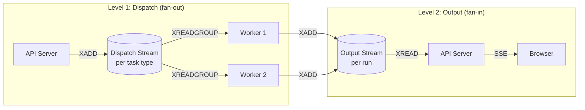
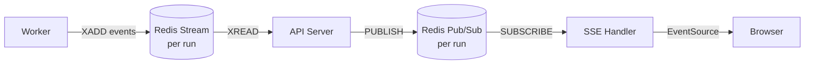

# Chapter 2: Agent Runtime & Orchestration

> How to execute agents reliably: task queuing, worker isolation, consumer groups, and recovery.

---

## The Core Problem

An infrastructure agent isn't a simple request-response API call. It's a **long-running, stateful, multi-step process** that:

- Can run for minutes to hours (waiting for CI pipelines, human approval)
- Uses expensive LLM tokens and cloud API calls
- Must survive worker crashes and restarts
- May need to pause and resume (human-in-the-loop)
- Must not interfere with other concurrent agents

This chapter covers how to build the runtime that handles all of this.

---

## Task Dispatch Architecture

### Two-Level Stream Pattern

Separate your dispatch (work distribution) from output (event sourcing):



**Level 1 (Dispatch)** uses consumer groups — each task goes to exactly one worker.
**Level 2 (Output)** is event sourcing — the API server reads all events and persists them.

### Redis Streams Implementation

```typescript
// === Dispatch side (API server) ===
async function dispatchTask(task: AgentTask): Promise<string> {
  const streamKey = `task:dispatch:${task.context.agentSlug}`;
  const messageId = await redis.xadd(streamKey, '*', {
    taskId: task.id,
    payload: JSON.stringify(task.payload),
    dispatchedAt: new Date().toISOString(),
  });
  return messageId;
}

// === Consumer side (Worker) ===
const CONSUMER_GROUP = 'agent-workers';
const CONSUMER_NAME = `worker-${process.pid}`;

async function consumeLoop() {
  // Ensure consumer group exists
  try {
    await redis.xgroup('CREATE', STREAM_KEY, CONSUMER_GROUP, '0', 'MKSTREAM');
  } catch (e) { /* group already exists */ }

  while (true) {
    // Read new messages (block up to 5 seconds)
    const messages = await redis.xreadgroup(
      'GROUP', CONSUMER_GROUP, CONSUMER_NAME,
      'COUNT', 1,
      'BLOCK', 5000,
      'STREAMS', STREAM_KEY, '>'
    );

    if (messages) {
      for (const [stream, entries] of messages) {
        for (const [id, fields] of entries) {
          await processTask(fields);
          await redis.xack(STREAM_KEY, CONSUMER_GROUP, id);
        }
      }
    }
  }
}
```

### Alternatives: Task Queue Options

#### BullMQ (Redis-backed, Node.js)

```typescript
import { Queue, Worker } from 'bullmq';

const agentQueue = new Queue('agent-tasks', { connection: redis });

// Dispatch
await agentQueue.add('remediation', payload, {
  priority: task.priority === 'critical' ? 1 : 10,
  attempts: 3,
  backoff: { type: 'exponential', delay: 5000 },
  timeout: 15 * 60 * 1000, // 15 min hard timeout
});

// Worker
const worker = new Worker('agent-tasks', async (job) => {
  await runAgent(job.data);
}, {
  concurrency: 2,   // Max concurrent agents per worker
  connection: redis,
});
```

#### AWS SQS + Lambda

```typescript
// Dispatch (API side)
import { SQS } from '@aws-sdk/client-sqs';
const sqs = new SQS();

await sqs.sendMessage({
  QueueUrl: process.env.AGENT_QUEUE_URL,
  MessageBody: JSON.stringify(task),
  MessageGroupId: task.context.organizationId,  // FIFO ordering
  MessageAttributes: {
    AgentSlug: { DataType: 'String', StringValue: task.context.agentSlug },
    Priority: { DataType: 'String', StringValue: task.context.priority },
  },
});

// Worker (Lambda handler)
export async function handler(event: SQSEvent) {
  for (const record of event.Records) {
    const task = JSON.parse(record.body);
    await runAgent(task);
  }
}
```

#### Temporal (Durable Workflows)

```typescript
import { proxyActivities, sleep } from '@temporalio/workflow';

// Define the agent workflow as a Temporal workflow
export async function remediationWorkflow(task: AgentTask): Promise<void> {
  const { cloneRepo, runAgent, triggerPipeline, createPR } =
    proxyActivities({ startToCloseTimeout: '10m' });

  // Each step is durable — survives crashes
  const repo = await cloneRepo(task.context.repositoryId);
  const agentResult = await runAgent(task.payload, repo);

  if (agentResult.hasChanges) {
    const planResult = await triggerPipeline(repo, 'plan');

    if (planResult.driftResources.length === 0) {
      await createPR(repo, agentResult.changes);
    } else {
      // Retry up to N times (Temporal handles the loop durably)
      for (let i = 0; i < 10; i++) {
        const retryResult = await runAgent(
          { ...task.payload, planFeedback: planResult },
          repo
        );
        const retryPlan = await triggerPipeline(repo, 'plan');
        if (retryPlan.driftResources.length === 0) {
          await createPR(repo, retryResult.changes);
          return;
        }
      }
      // Max iterations reached — escalate
      await createPR(repo, agentResult.changes, { note: 'Drift remains after 10 attempts' });
    }
  }
}
```

---

## Worker Deployment Models

### Model 1: Long-Running Daemon

Workers run continuously, processing tasks from the queue. Good for steady workloads.

```
┌──────────────────────────────┐
│  Docker Container / VM       │
│  ┌────────────────────────┐  │
│  │  Worker Process        │  │
│  │  - Consumer loop       │  │
│  │  - Concurrent tasks    │  │
│  │  - Heartbeat emitter   │  │
│  └────────────────────────┘  │
└──────────────────────────────┘
  Runs forever. Processes many tasks.
  Scales by adding more containers.
```

```typescript
// Daemon mode: process tasks concurrently
const MAX_CONCURRENT = 3;
const activeTasks = new Map<string, Promise<void>>();

while (true) {
  if (activeTasks.size >= MAX_CONCURRENT) {
    await Promise.race(activeTasks.values());
    continue;
  }

  const message = await claimNextTask();
  if (message) {
    const promise = processTask(message)
      .finally(() => activeTasks.delete(message.id));
    activeTasks.set(message.id, promise);
  }
}
```

### Model 2: Job-Per-Task (Serverless)

A new container/function is spun up for each task. Good for bursty, expensive workloads.

```
Task arrives → Spin up container → Process → Exit

Providers:
├── Modal        (Python/Node, GPU support, ~2s cold start)
├── Azure Container App Jobs  (Docker, managed identity)
├── AWS Lambda   (15min limit — may not be enough)
├── Google Cloud Run Jobs     (Docker, up to 24h)
└── Kubernetes Jobs           (any container, full control)
```

```typescript
// Job mode: process exactly one task, then exit
const message = await claimNextTask();
if (message) {
  await processTask(message);
  process.exit(0);
} else {
  // No work available
  process.exit(0);
}
```

### Model 3: Hybrid (Recommended)

Use daemons for interactive sessions (low latency on follow-ups) and jobs for batch work (drift scans, compliance remediation).

```typescript
const WORKER_MODE = process.env.TASK_WORKER_MODE || 'daemon';

if (WORKER_MODE === 'job') {
  // Process one task and exit
  const msg = await claimNextTask();
  if (msg) await processTask(msg);
  process.exit(0);
} else {
  // Run forever, handle concurrent tasks
  await startDaemonLoop();
}
```

---

## Crash Recovery & Stuck Task Detection

Workers crash. Networks fail. LLMs hang. You need:

### 1. Heartbeat-Based Health Checks

```typescript
// Worker: emit heartbeat every 30 seconds
const HEARTBEAT_KEY = `worker:active:${sessionId}`;
const HEARTBEAT_TTL = 90; // seconds

async function emitHeartbeat() {
  await redis.set(HEARTBEAT_KEY, Date.now().toString(), 'EX', HEARTBEAT_TTL);
}

const heartbeatInterval = setInterval(emitHeartbeat, 30_000);
```

### 2. Stuck Run Watchdog

```typescript
// API Server: periodic check for stuck tasks
async function watchdogLoop() {
  setInterval(async () => {
    // Find runs that have been QUEUED > 5min or RUNNING > 15min
    const stuckRuns = await db.agentRun.findMany({
      where: {
        OR: [
          { status: 'QUEUED', updatedAt: { lt: minutesAgo(5) } },
          { status: 'RUNNING', updatedAt: { lt: minutesAgo(15) } },
        ],
      },
    });

    for (const run of stuckRuns) {
      // Check if worker is still alive
      const heartbeat = await redis.get(`worker:active:${run.sessionId}`);

      if (!heartbeat) {
        // Worker is dead — mark run as failed and retry
        await db.agentRun.update({
          where: { id: run.id },
          data: { status: 'FAILED', failureReason: 'Worker heartbeat expired' },
        });
        await dispatchRetry(run);
      }
    }
  }, 60_000); // Check every minute
}
```

### 3. Consumer Group Pending Entry List (PEL) Recovery

When using Redis Streams, unacknowledged messages stay in the PEL. On worker startup, reclaim them:

```typescript
async function recoverPendingMessages() {
  // Find messages claimed by dead consumers
  const pending = await redis.xpending(
    STREAM_KEY, CONSUMER_GROUP,
    '-', '+', 100 // up to 100 pending messages
  );

  for (const entry of pending) {
    const [messageId, consumer, idleTime] = entry;

    if (idleTime > 5 * 60 * 1000) { // Idle > 5 minutes
      // Reclaim the message
      const claimed = await redis.xclaim(
        STREAM_KEY, CONSUMER_GROUP, CONSUMER_NAME,
        5 * 60 * 1000, // min idle time
        messageId
      );

      for (const msg of claimed) {
        await processTask(msg);
        await redis.xack(STREAM_KEY, CONSUMER_GROUP, msg.id);
      }
    }
  }
}

// Run on startup before entering the consumer loop
await recoverPendingMessages();
```

---

## Task Type Routing

Different agent tasks have different resource profiles. Route them to specialized worker pools:

```
┌─────────────────────────────────────────────┐
│              Dispatch Streams                │
├─────────────────┬───────────────────────────┤
│  background-agent (expensive, long-running) │──→ GPU/high-memory workers
│  static-analysis (CPU-only, fast)           │──→ Cheap compute pool
│  compliance-scan (network-heavy)            │──→ Scanner pool
│  pr-review (moderate, read-heavy)           │──→ General pool
└─────────────────┴───────────────────────────┘
```

```typescript
// Worker filters by task type
const TASK_TYPE_FILTER = process.env.TASK_TYPE_FILTER?.split(',') || ['*'];

async function shouldProcess(taskType: string): boolean {
  if (TASK_TYPE_FILTER.includes('*')) return true;
  return TASK_TYPE_FILTER.includes(taskType);
}
```

---

## Task Schema Registry

Define schemas as a single source of truth shared between dispatcher and workers:

```typescript
import { z } from 'zod';

// Shared between API server and workers
export const TASK_REGISTRY = {
  'background-agent': {
    payloadSchema: z.object({
      sessionId: z.string().uuid(),
      agentSlug: z.string(),
      prompt: z.string(),
      repositories: z.array(GitRepoSchema),
      policies: z.array(z.string()).default([]),
    }),
    queue: 'task:dispatch:background-agent',
    timeout: 30 * 60 * 1000,  // 30 min
  },
  'static-analysis': {
    payloadSchema: z.object({
      repositoryId: z.string().uuid(),
      branch: z.string(),
      tools: z.array(z.enum(['checkov', 'tflint', 'tfsec'])),
    }),
    queue: 'task:dispatch:static-analysis',
    timeout: 5 * 60 * 1000,  // 5 min
  },
  'drift-scan': {
    payloadSchema: z.object({
      pipelineId: z.string().uuid(),
      environments: z.array(z.string()).optional(),
    }),
    queue: 'task:dispatch:drift-scan',
    timeout: 10 * 60 * 1000,  // 10 min
  },
} as const;

type TaskType = keyof typeof TASK_REGISTRY;
```

---

## Real-Time Output Streaming

Agents are slow. Users need to see what's happening in real-time. Use Server-Sent Events (SSE) backed by pub/sub:



```typescript
// Worker: emit events to output stream
async function emitEvent(runId: string, event: AgentEvent) {
  await redis.xadd(`task:run:${runId}`, '*', {
    type: event.type,
    data: JSON.stringify(event.data),
    timestamp: Date.now().toString(),
  });
}

// API Server: SSE endpoint
app.get('/api/v1/sessions/:sessionId/runs/:runId/events', (req, res) => {
  res.setHeader('Content-Type', 'text/event-stream');
  res.setHeader('Cache-Control', 'no-cache');
  res.setHeader('Connection', 'keep-alive');

  const channel = `task-events:${req.params.runId}`;

  // 1. Send historical events (catch-up)
  const history = await redis.xrange(`task:run:${req.params.runId}`, '-', '+');
  for (const [id, fields] of history) {
    res.write(`data: ${JSON.stringify(fields)}\n\n`);
  }

  // 2. Subscribe for live events
  const subscriber = redis.duplicate();
  await subscriber.subscribe(channel);
  subscriber.on('message', (ch, message) => {
    res.write(`data: ${message}\n\n`);
  });

  req.on('close', () => subscriber.unsubscribe());
});
```

---

## Comparison: Runtime Approaches

| Approach | Latency | Cost | Complexity | Best For |
|----------|---------|------|-----------|----------|
| Docker + Redis Streams | Low | Fixed (always-on) | Medium | Interactive agents, multi-turn |
| Modal serverless | ~2s cold start | Pay-per-use | Low | Batch remediation, spiky workloads |
| Azure Container App Jobs | ~10s cold start | Pay-per-use | Medium | Azure-native, managed identity |
| AWS Lambda + SQS | ~1s cold start | Pay-per-use | Medium | AWS-native, short tasks (<15min) |
| Temporal + Workers | Low (warm) | Fixed + Temporal server | High | Complex multi-step, durable workflows |
| Kubernetes Jobs | ~5s | Cluster cost | High | Full control, multi-cloud |

---

## Key Takeaways

1. **Separate dispatch from output** — use consumer groups for load balancing, event streams for observability
2. **Workers should be stateless** — never write to the database directly
3. **Plan for crashes** — heartbeats + watchdogs + PEL recovery
4. **Route by task type** — different tasks need different compute profiles
5. **Stream output in real-time** — agents are slow, users need visibility
6. **Choose your deployment model** based on your workload pattern (steady vs bursty)

---

## Next Chapter

[Chapter 3: Skill & Tool System →](./03-skill-system.md)
