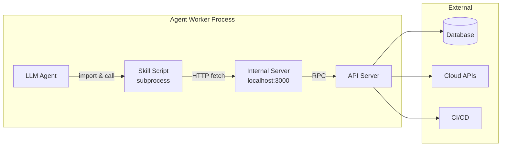

# Chapter 3: Skill & Tool System

> How agents gain capabilities — safely and extensibly.

---

## The Problem With Raw Tool Access

The naive approach to agent tools is: register shell commands, let the model call them. This is how most early agents worked (AutoGPT, BabyAGI) and it's how most security incidents happen.

The issues:
- **Shell is too powerful** — `rm -rf /`, `curl | bash`, credential exfiltration
- **Tools are untyped** — the model can pass any arguments
- **No documentation** — the model guesses how tools work
- **No isolation** — tools share the same process/permissions as the agent

A better approach: **Skills as typed, documented, isolated capabilities**.

---

## The Skills-as-Files Pattern

Instead of registering tool handlers in code, write skills as files that the agent can read and execute:

```
.claude/skills/
├── terraform-plan/
│   ├── SKILL.md           # Instructions for the agent (documentation)
│   └── client.ts          # Typed API client (executable code)
├── drift-verification/
│   ├── SKILL.md
│   └── client.ts
├── git-operations/
│   ├── SKILL.md
│   └── client.ts
└── cloud-credentials/
    ├── SKILL.md
    └── client.ts
```

### Why This Pattern Is Elegant

1. **Self-documenting** — The agent reads SKILL.md to understand what the skill does, when to use it, and what constraints apply
2. **Typed execution** — client.ts provides a typed interface; the agent imports and calls functions
3. **Isolated** — Skills run as subprocess scripts with no access to the worker's internals
4. **Auditable** — Every skill file can be version-controlled and reviewed
5. **Runtime-injectable** — Skills can be added/removed per agent, per organization, at dispatch time

### Example: Terraform Plan Skill

**SKILL.md**:
```markdown
# Terraform Plan Skill

## When to Use
Use this skill after making changes to Terraform files to validate
your changes produce the expected plan output.

## How It Works
1. Call `triggerPlan(pipelineId)` to start a plan execution
2. Poll `getPlanStatus(runId)` until the run completes
3. Read the parsed output to verify:
   - No unexpected resource deletions
   - No drift remaining on target resources
   - Plan succeeds without errors

## Constraints
- NEVER call this on a pipeline you don't have permission for
- ALWAYS check the plan output before creating a PR
- If the plan shows unexpected changes, STOP and ask the user
- Maximum 10 plan iterations per session

## Error Handling
- If the pipeline fails, check the error output for syntax errors
- If the pipeline times out, wait 60 seconds and retry once
- If authentication fails, request fresh credentials
```

**client.ts**:
```typescript
const INTERNAL_API = 'http://localhost:3000';

interface PlanResult {
  runId: string;
  status: 'success' | 'failure' | 'timeout';
  driftResources: Array<{
    address: string;
    resourceId: string;
    changeType: 'create' | 'update' | 'delete' | 'no-op';
  }>;
  allResources: Array<{ address: string; resourceId: string }>;
  rawOutput?: string;
  error?: string;
}

export async function triggerPlan(pipelineId: string): Promise<{ runId: string }> {
  const res = await fetch(`${INTERNAL_API}/run-iac-pipeline`, {
    method: 'POST',
    headers: { 'Content-Type': 'application/json' },
    body: JSON.stringify({ pipelineId, type: 'PLAN' }),
  });
  return res.json();
}

export async function getPlanStatus(runId: string): Promise<PlanResult> {
  const res = await fetch(`${INTERNAL_API}/get-iac-pipeline-status`, {
    method: 'POST',
    headers: { 'Content-Type': 'application/json' },
    body: JSON.stringify({ runId }),
  });
  return res.json();
}
```

---

## Internal Server: The Capability Bridge

Skills can't access the database, cloud APIs, or worker internals directly. They communicate through a local HTTP server running inside the worker:



```typescript
// Internal server — runs inside the worker process
import { serve } from 'bun'; // or express, fastify, etc.

const server = serve({
  port: 3000,
  async fetch(req) {
    const url = new URL(req.url);

    switch (url.pathname) {
      case '/run-iac-pipeline':
        return handleRunPipeline(req);
      case '/get-cloud-credentials':
        return handleGetCredentials(req);
      case '/create-pull-request':
        return handleCreatePR(req);
      case '/ask-user':
        return handleAskUser(req);
      default:
        return new Response('Not found', { status: 404 });
    }
  },
});

async function handleGetCredentials(req: Request): Response {
  const { integrationId, scope } = await req.json();

  // Validate the request against the current task context
  if (!isAllowedIntegration(integrationId)) {
    return Response.json({ error: 'Integration not authorized' }, { status: 403 });
  }

  // RPC to API server — which generates short-lived tokens
  const token = await rpcCall('generateCloudToken', {
    integrationId,
    organizationId: currentContext.organizationId,
    scope,
  });

  return Response.json({ token, expiresIn: 3600 });
}
```

### Why Not Direct MCP/Tool Registration?

| Approach | Pros | Cons |
|----------|------|------|
| **Skills as files** (recommended) | Agent can read docs; typed clients; easy to add/remove per context; version-controlled | Slightly more setup; requires internal server |
| **MCP tool registration** | Standard protocol; some LLMs support natively | Less documentation; harder to scope per-agent; tight coupling |
| **Direct function calls** | Simplest; no HTTP overhead | No isolation; hard to audit; agent can call anything |
| **OpenAI-style function calling** | Model generates structured args; you validate | Schema-only docs; no rich documentation; tied to one provider |

---

## Skill Categories for Infrastructure Agents

### IaC Lifecycle Skills

| Skill | Purpose | Risk Level |
|-------|---------|------------|
| `terraform-plan` | Trigger and read plan output | Low (read-only) |
| `terraform-validate` | Syntax/config validation | Low |
| `bicep-what-if` | Azure deployment preview | Low (read-only) |
| `iac-lint` | Static analysis (tflint, checkov) | Low |
| `drift-verification` | Compare state vs. code | Low (read-only) |

### Git & PR Skills

| Skill | Purpose | Risk Level |
|-------|---------|------------|
| `git-branch` | Create/switch branches | Low |
| `git-commit` | Stage and commit changes | Medium |
| `git-push` | Push to remote | Medium |
| `create-pr` | Open a pull request | Medium |
| `pr-comment` | Post review comments | Low |

### Cloud Interaction Skills

| Skill | Purpose | Risk Level |
|-------|---------|------------|
| `cloud-credentials` | Request short-lived tokens | High (gated) |
| `resource-describe` | Read cloud resource state | Low |
| `resource-import` | Import into Terraform state | High (gated) |

### Communication Skills

| Skill | Purpose | Risk Level |
|-------|---------|------------|
| `ask-user` | Pause for human input | Low |
| `notify-slack` | Post status to Slack | Low |
| `create-ticket` | Open a Jira/Linear issue | Low |

---

## Skill Hydration: Loading Skills at Runtime

Before the agent starts, the worker writes skill files to the working directory based on the agent's configuration:

```typescript
interface SkillDefinition {
  name: string;
  markdown: string;    // SKILL.md content
  clientCode: string;  // client.ts content
  category: 'iac' | 'git' | 'cloud' | 'communication';
}

async function hydrateSkills(
  workDir: string,
  agentConfig: AgentConfig,
  orgPolicies: PolicyDigest
): Promise<number> {
  const skillsDir = path.join(workDir, '.claude', 'skills');
  await fs.mkdir(skillsDir, { recursive: true });

  let count = 0;

  for (const skill of getSkillsForAgent(agentConfig)) {
    // Check if agent is allowed to use this skill
    if (agentConfig.allowedTools.length > 0 &&
        !agentConfig.allowedTools.includes(skill.name)) {
      continue;
    }

    const skillDir = path.join(skillsDir, skill.name);
    await fs.mkdir(skillDir, { recursive: true });

    // Inject policy constraints into the SKILL.md
    const enrichedMarkdown = injectPolicyConstraints(
      skill.markdown,
      orgPolicies
    );

    await fs.writeFile(path.join(skillDir, 'SKILL.md'), enrichedMarkdown);
    await fs.writeFile(path.join(skillDir, 'client.ts'), skill.clientCode);
    count++;
  }

  return count;
}
```

---

## Tool Allow/Deny Lists

Restrict what tools each agent type can access:

```typescript
// Agent configuration — stored in database
interface AgentConfig {
  slug: string;                 // 'infrastructure', 'pr-reviewer', etc.
  allowedTools: string[];       // Empty = all allowed
  maxTurns: number;             // Iteration limit (e.g., 50)
  producesCodeChanges: boolean; // Whether this agent modifies files
  requiresRepository: boolean;  // Whether git context is needed
}

// Example configurations
const AGENT_CONFIGS = {
  'pr-reviewer': {
    allowedTools: ['git-diff', 'pr-comment', 'iac-lint'],  // Read-only + comment
    maxTurns: 20,
    producesCodeChanges: false,
    requiresRepository: true,
  },
  'compliance-remediation': {
    allowedTools: [],  // All tools (needs to write code, run plans, create PRs)
    maxTurns: 50,
    producesCodeChanges: true,
    requiresRepository: true,
  },
  'drift-detection': {
    allowedTools: ['terraform-plan', 'drift-verification', 'notify-slack'],
    maxTurns: 10,
    producesCodeChanges: false,
    requiresRepository: true,
  },
};
```

---

## Alternatives for Skill/Tool Systems

### LangChain Tools

```python
from langchain.tools import tool

@tool
def terraform_plan(pipeline_id: str) -> str:
    """Trigger a Terraform plan and return the result."""
    result = requests.post(f"{API_URL}/run-pipeline", json={"id": pipeline_id})
    return result.json()

# Register with agent
agent = create_react_agent(llm, [terraform_plan, ...])
```

### OpenAI Function Calling

```typescript
const tools = [{
  type: 'function',
  function: {
    name: 'terraform_plan',
    description: 'Trigger a Terraform plan execution',
    parameters: {
      type: 'object',
      properties: {
        pipeline_id: { type: 'string', description: 'The pipeline to run' },
      },
      required: ['pipeline_id'],
    },
  },
}];

// Agent loop
const response = await openai.chat.completions.create({
  model: 'gpt-4',
  messages,
  tools,
});

if (response.choices[0].message.tool_calls) {
  for (const call of response.choices[0].message.tool_calls) {
    const result = await executeToolCall(call);
    messages.push({ role: 'tool', content: result, tool_call_id: call.id });
  }
}
```

### MCP (Model Context Protocol)

```typescript
import { McpServer } from '@modelcontextprotocol/sdk/server';

const server = new McpServer({ name: 'infra-tools' });

server.tool('terraform_plan', { pipelineId: z.string() }, async ({ pipelineId }) => {
  const result = await triggerPlan(pipelineId);
  return { content: [{ type: 'text', text: JSON.stringify(result) }] };
});
```

---

## Key Takeaways

1. **Skills = documentation + typed code** — the agent learns by reading and acts by executing
2. **Internal HTTP server** is the bridge between sandboxed skill code and platform capabilities
3. **Allow/deny lists** constrain what each agent type can do
4. **Hydrate at runtime** — inject only the skills needed for this specific task
5. **Policy enrichment** — weave org-specific constraints into skill documentation

---

## Next Chapter

[Chapter 4: Sandboxed Execution →](./04-sandboxed-execution.md)
