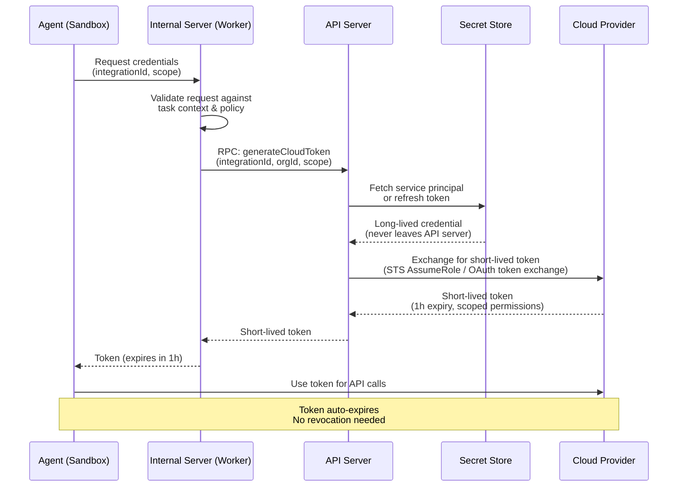

# Chapter 5: Credential Management

> Short-lived tokens, task-scoped access, vault patterns, and blast radius control.

---

## The Cardinal Rule

> **Agents never hold long-lived credentials. Ever.**

No API keys in environment variables. No service principal secrets in config files. No SSH keys on disk. The agent requests credentials just-in-time from a broker, gets a short-lived token scoped to the minimum required permissions, and the token expires automatically.

Get this wrong and nothing else matters.

---

## What Happens When You Don't

Real-world incidents from production agent deployments:
- **Infostealer malware** targeting agent config directories to extract API keys and auth tokens
- **Prompt injection** causing agents to exfiltrate credentials via tool calls
- **Framework CVEs** enabling secret extraction from serialized agent state

Short-lived, narrowly-scoped tokens turn all of these from catastrophic breaches into time-boxed incidents.

---

## Credential Flow Architecture



---

## Implementation by Cloud Provider

### AWS: STS AssumeRole

```typescript
import { STSClient, AssumeRoleCommand } from '@aws-sdk/client-sts';

async function generateAwsToken(
  integration: AwsIntegration,
  sessionName: string
): Promise<AwsCredentials> {
  const sts = new STSClient({ region: integration.defaultRegion });

  const response = await sts.send(new AssumeRoleCommand({
    RoleArn: integration.roleArn,        // Cross-account role
    RoleSessionName: `agent-${sessionName}`,
    DurationSeconds: 3600,               // 1 hour
    // Optional: further restrict permissions
    Policy: JSON.stringify({
      Version: '2012-10-17',
      Statement: [{
        Effect: 'Allow',
        Action: [
          's3:GetObject', 's3:PutObject',  // Only what's needed
          'ec2:Describe*',
        ],
        Resource: '*',
      }],
    }),
  }));

  return {
    accessKeyId: response.Credentials.AccessKeyId,
    secretAccessKey: response.Credentials.SecretAccessKey,
    sessionToken: response.Credentials.SessionToken,
    expiration: response.Credentials.Expiration,
  };
}
```

### Azure: OAuth Token Exchange

```typescript
import { ConfidentialClientApplication } from '@azure/msal-node';

async function generateAzureToken(
  integration: AzureIntegration,
  scope: string = 'https://management.azure.com/.default'
): Promise<AzureToken> {
  // For OAuth integrations: use refresh token
  if (integration.authMethod === 'OAuth') {
    const msalClient = new ConfidentialClientApplication({
      auth: {
        clientId: AZURE_APP_CLIENT_ID,
        clientSecret: AZURE_APP_CLIENT_SECRET,
        authority: `https://login.microsoftonline.com/${integration.tenantId}`,
      },
    });

    const result = await msalClient.acquireTokenByRefreshToken({
      refreshToken: integration.refreshToken,  // Stored encrypted
      scopes: [scope],
    });

    return {
      accessToken: result.accessToken,
      expiresOn: result.expiresOn,
      subscriptionId: integration.subscriptionId,
    };
  }

  // For service principal: client credentials flow
  // Still produces a short-lived token
  const result = await msalClient.acquireTokenByClientCredential({
    scopes: [scope],
  });

  return { accessToken: result.accessToken, expiresOn: result.expiresOn };
}
```

### GCP: Service Account Impersonation

```typescript
import { IAMCredentialsClient } from '@google-cloud/iam-credentials';

async function generateGcpToken(
  integration: GcpIntegration,
  scopes: string[] = ['https://www.googleapis.com/auth/cloud-platform']
): Promise<GcpToken> {
  const client = new IAMCredentialsClient();

  // Impersonate the service account to get a short-lived token
  const [response] = await client.generateAccessToken({
    name: `projects/-/serviceAccounts/${integration.serviceAccountEmail}`,
    scope: scopes,
    lifetime: { seconds: 3600 }, // 1 hour
  });

  return {
    accessToken: response.accessToken,
    expireTime: response.expireTime,
  };
}
```

---

## The Credential Broker

The credential broker sits between the agent sandbox and your secret store. It validates every credential request against the current task's authorization context before issuing a short-lived token.

Key responsibilities:
1. **Validate ownership** — confirm the requested cloud integration belongs to this organization and is authorized for this task
2. **Enforce scope limits** — check that the requested permissions don't exceed policy limits
3. **Generate short-lived tokens** — exchange long-lived credentials (in the vault) for short-lived tokens (given to the agent)
4. **Audit every issuance** — log which agent, which session, which scope, and when the token expires

```typescript
// Example credential broker handler
async function handleGetCredentials(req: Request): Promise<Response> {
  const { integrationId, scope } = await req.json();
  const taskContext = getTaskContext(); // From the current execution context

  // 1. Validate integration belongs to this organization
  if (!taskContext.authorizedIntegrations.includes(integrationId)) {
    return Response.json(
      { error: 'Integration not authorized for this task' },
      { status: 403 }
    );
  }

  // 2. Validate scope is within allowed limits
  if (scope && !isAllowedScope(scope, taskContext.policy)) {
    return Response.json(
      { error: `Scope '${scope}' exceeds policy limits` },
      { status: 403 }
    );
  }

  // 3. Request short-lived token from the API server / vault
  const token = await requestCloudToken({
    integrationId,
    organizationId: taskContext.organizationId,
    scope,
    requestedBy: taskContext.agentId,
  });

  // 4. Log the credential issuance for audit
  await emitAuditEvent({
    type: 'credential_issued',
    integrationId,
    scope,
    agentId: taskContext.agentId,
    expiresAt: token.expiresAt,
  });

  return Response.json(token);
}
```

---

## Task-Scoped Credentials: Let Agents Run Freely

The hardest part of deploying infrastructure agents isn't the technology — it's trust. Teams hesitate to let agents run autonomously because a single over-privileged credential can cause real damage. The fix isn't more approval gates. It's **scoping credentials so tightly that the agent can't cause damage even if it tries**.

When an agent has read-only access to your AWS account and write access only to a single Terraform file in one repository, you can let it run freely. There's nothing dangerous it *can* do. This changes the conversation from "should we let the agent do this?" to "the agent can do whatever it needs within these bounds."

### Default to Read-Only

Every agent task should start with the minimum credential scope. Most agent operations are read-heavy:

| Task Type | What the Agent Actually Needs | Credential Scope |
|-----------|------------------------------|-----------------|
| Compliance scan | List resources, read configurations | **Read-only** cloud access |
| Drift detection | Run `terraform plan` (reads state, compares) | **Read-only** cloud + read state |
| Code analysis | Read repository files, check syntax | **Git read** only |
| Cost analysis | Query billing APIs, describe resources | **Read-only** billing + describe |
| Remediation | Write Terraform files, create branch, open PR | **Git write** + read-only cloud |
| Live remediation | All of the above + `terraform apply` | **Write** cloud (rare, gated) |

Notice that even remediation — fixing a compliance finding — typically only needs **git write** permissions. The agent edits code and opens a PR. It doesn't need cloud write access because CI/CD handles the apply. This is the safest and most common pattern.

### Make Scope Selection Easy

The system should make it trivial for admins to configure and for agents to request the right scope. Pre-define named scopes that map to cloud provider permissions:

```
SCOPES:
  read-only:
    AWS:   arn:aws:iam::*:role/agent-readonly    (Describe*, List*, Get*)
    Azure: Reader role on subscription
    GCP:   roles/viewer on project

  terraform-plan:
    AWS:   arn:aws:iam::*:role/agent-plan         (ReadOnly + state access)
    Azure: Reader + Terraform state storage access
    GCP:   roles/viewer + storage.objects.get (for state)

  git-write:
    GitHub: Contents (write), Pull Requests (write), limited to specific repos
    GitLab: Developer role on specific projects

  cloud-write:
    AWS:   arn:aws:iam::*:role/agent-apply         (scoped to specific services)
    Azure: Contributor on specific resource groups
    GCP:   roles/editor on specific projects
    ⚠️  Requires approval gate — never issued automatically
```

Each agent type maps to a default scope. A compliance scanner gets `read-only`. A remediation agent gets `read-only` cloud + `git-write`. An admin can override per-task, but the defaults are safe.

### Easy Credential Swapping

Agents often need credentials from multiple systems during a single task — cloud read access to understand the current state, git write access to push a fix, and maybe a different cloud account's read access to compare configurations.

The credential broker should make swapping between scopes seamless:

1. **Agent requests credentials by intent, not by raw IAM policy.** It asks for "read-only access to the production AWS account" — not for a specific role ARN. The broker maps intent to the right credential.

2. **Multiple credentials in one session.** The agent can hold a read-only cloud token *and* a git write token simultaneously. Each is scoped independently. Revoking one doesn't affect the other.

3. **Scope escalation is explicit.** If a task starts as read-only analysis but the agent decides it needs write access to fix something, it requests an escalation. The broker can require human approval for the upgrade without interrupting the read-only work already done.

4. **Credentials are swappable across cloud providers.** A multi-cloud agent working across AWS and Azure gets separate tokens for each, each with its own scope and expiry. The agent doesn't manage credentials — it just requests access by provider and intent.

### Why This Matters

When credentials are properly scoped:
- **Agents run autonomously without fear.** A read-only agent can analyze your entire infrastructure and the worst it can do is waste tokens.
- **Users trust the system.** They see that the compliance scanner *literally cannot* modify resources — it's not a policy that might be bypassed, it's a credential that doesn't have write permissions.
- **Blast radius is bounded.** Even if the agent is compromised via prompt injection, the token it holds can only do what its scope allows. A read-only token is useless for an attacker who wants to modify infrastructure.
- **Audit is meaningful.** Each credential issuance logs the scope, so you can see exactly what level of access each agent session had — not just that it *could* have done something, but what it was *authorized* to do.

The goal: **an admin configures scopes once, agents request credentials by intent, and the system guarantees that no agent ever gets more access than its task requires.**

---

## Secret Storage Alternatives

### HashiCorp Vault

```typescript
import Vault from 'node-vault';

const vault = Vault({
  endpoint: process.env.VAULT_ADDR,
  token: process.env.VAULT_TOKEN,
});

// Store integration credentials
await vault.write('secret/data/integrations/aws-prod', {
  data: {
    roleArn: 'arn:aws:iam::123456789:role/agent-role',
    externalId: 'infra-agent-platform',
  },
});

// Read at token generation time (API server only)
const secret = await vault.read('secret/data/integrations/aws-prod');
```

### AWS Secrets Manager

```typescript
import { SecretsManager } from '@aws-sdk/client-secrets-manager';

const sm = new SecretsManager();
const secret = await sm.getSecretValue({
  SecretId: `integrations/${integrationId}`,
});
const credentials = JSON.parse(secret.SecretString);
```

### Azure Key Vault

```typescript
import { SecretClient } from '@azure/keyvault-secrets';
import { DefaultAzureCredential } from '@azure/identity';

const client = new SecretClient(
  `https://${VAULT_NAME}.vault.azure.net`,
  new DefaultAzureCredential()
);

const secret = await client.getSecret(`integration-${integrationId}`);
```

### 1Password (via Connect Server)

```typescript
const response = await fetch(`${OP_CONNECT_URL}/v1/vaults/${VAULT_ID}/items/${ITEM_ID}`, {
  headers: { 'Authorization': `Bearer ${OP_TOKEN}` },
});
const item = await response.json();
```

---

## Defense-in-Depth Checklist

```
[ ] Long-lived credentials ONLY in API server / vault — never in workers
[ ] Short-lived tokens (1h max) for all agent operations
[ ] Default scope is read-only — write access requires explicit configuration
[ ] Named scopes defined per cloud provider (read-only, plan, git-write, cloud-write)
[ ] Each agent type mapped to a default scope — overrides require admin action
[ ] Scope tokens to minimum required permissions (inline policy / session tags)
[ ] Validate integration ownership before issuing tokens
[ ] Log every credential issuance with scope and correlation ID
[ ] Block cloud metadata endpoints in sandbox (169.254.169.254)
[ ] Encrypt credentials at rest in the database
[ ] Rotate refresh tokens on a schedule
[ ] Credential requests fail closed (deny on error)
[ ] No credentials in agent prompts, logs, or error messages
[ ] Scope escalation (read → write) requires human approval
```

---

## Anti-Patterns to Avoid

| Anti-Pattern | Why It's Dangerous | Better Approach |
|-------------|-------------------|-----------------|
| API keys in env vars | Visible to all processes, logged in crashes | Credential broker with short-lived tokens |
| Service principal secrets in agent config | Stolen by infostealers, leaked in serialization | Managed identity or vault-backed generation |
| Long-lived OAuth tokens | Wide blast radius if compromised | Refresh token in vault, short-lived access tokens |
| Shared credentials across agents | One compromised agent = all agents compromised | Per-agent, per-session token issuance |
| Credentials in LLM prompts | Model can repeat them in output | Inject into tool environment, not prompt text |
| No credential expiry | Compromised tokens live forever | 1h TTL with no renewal option |

---

## Next Chapter

[Chapter 6: The Data Plane →](./06-data-plane.md)
