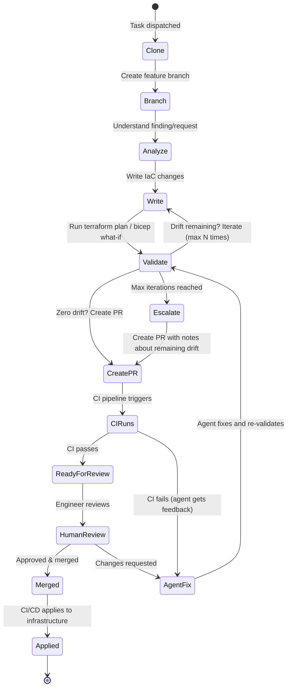

# Chapter 6: Change Control & GitOps

> PR-based workflows, drift verification loops, and validation gates.

---

## The Golden Rule (Again)

```
Agent writes code → Agent creates PR → CI validates → Human reviews → CI applies
```

This is not optional. This is not a suggestion. This is the architectural boundary that prevents an infrastructure agent from becoming an infrastructure incident.

---

## Why PR-Based Change Control

| Without PR workflow | With PR workflow |
|--------------------|-----------------|
| Agent applies directly to prod | Agent produces a reviewable diff |
| No audit trail of what changed | Full git history of every change |
| No rollback path | `git revert` restores previous state |
| No human checkpoint | Human reviews before merge |
| Hard to understand agent reasoning | PR description explains the why |
| One bad decision = outage | One bad decision = closed PR |

---

## The Agent PR Lifecycle



---

## Pre-PR Validation Loop

The most important pattern: **never create a PR without validating the changes first**.

```typescript
async function validateAndCreatePR(
  context: AgentContext,
  maxIterations: number = 10
): Promise<PRResult> {
  for (let i = 0; i < maxIterations; i++) {
    // 1. Run the IaC validation pipeline
    const planResult = await triggerPipeline(context.pipelineId, 'PLAN');

    // 2. Check for remaining drift
    if (planResult.driftResources.length === 0) {
      // No drift — safe to create PR
      return await createPullRequest(context, {
        title: `fix: ${context.findingTitle}`,
        body: formatPRBody(context, planResult),
        validationPassed: true,
        iterations: i + 1,
      });
    }

    // 3. Feed plan output back to agent for correction
    const feedback = formatDriftFeedback(planResult);
    await agentSession.continue(
      `Plan shows ${planResult.driftResources.length} remaining drift items:\n${feedback}\n` +
      `Please fix these issues. Iteration ${i + 1}/${maxIterations}.`
    );
  }

  // Max iterations reached — create PR anyway with documentation
  return await createPullRequest(context, {
    title: `fix: ${context.findingTitle} (needs review)`,
    body: formatPRBody(context, lastPlanResult, {
      note: `Agent reached max iterations (${maxIterations}). Remaining drift documented below.`,
    }),
    validationPassed: false,
    iterations: maxIterations,
  });
}
```

---

## Multi-Environment Validation (Matrix Pipelines)

Infrastructure often spans multiple environments. A single pipeline run can produce artifacts for dev, staging, and prod:

```typescript
interface PipelineResult {
  runId: string;
  status: 'success' | 'failure';
  // Matrix dimensions (environments)
  dimensions?: string[];  // e.g., ['dev', 'staging', 'prod']
  outputs: {
    plan: {
      // Flat (single environment)
      parsed?: PlanOutput;
      // Or per-dimension
      [dimension: string]: { parsed: PlanOutput } | undefined;
    };
  };
}

// Check all dimensions for drift
function hasRemainingDrift(result: PipelineResult): boolean {
  if (result.dimensions?.length) {
    return result.dimensions.some(dim => {
      const output = result.outputs.plan[dim]?.parsed;
      return output?.driftResources?.length > 0;
    });
  }
  return (result.outputs.plan.parsed?.driftResources?.length ?? 0) > 0;
}
```

---

## PR Body Format

A well-structured PR body is critical for human reviewers:

```markdown
## Summary
Fixes compliance finding: S3 bucket `my-bucket` missing server-side encryption.

## Changes
- Added `server_side_encryption_configuration` block to `modules/storage/main.tf`
- Set default encryption to `aws:kms` with auto-generated key

## Validation
- Terraform plan: **PASSED** (0 drift remaining)
- Iterations: 2 (first attempt had syntax error)
- Environment: production

## Plan Output
```hcl
# aws_s3_bucket.my_bucket will be updated in-place
~ resource "aws_s3_bucket" "my_bucket" {
    + server_side_encryption_configuration {
        + rule {
            + apply_server_side_encryption_by_default {
                + sse_algorithm = "aws:kms"
              }
          }
      }
  }
```

## Finding Details
- Source: Prowler
- Severity: HIGH
- Framework: CIS AWS Benchmark v3.0
- Control: 2.1.1 - Ensure S3 bucket has server-side encryption enabled

---
Agent Session: abc-123-def-456
```

---

## CI/CD Integration Patterns

### GitHub Actions

```yaml
# .github/workflows/terraform-plan.yml
name: Terraform Plan
on:
  pull_request:
    paths: ['**/*.tf', '**/*.tfvars']

jobs:
  plan:
    runs-on: ubuntu-latest
    permissions:
      pull-requests: write
      id-token: write  # For OIDC auth
    steps:
      - uses: actions/checkout@v4
      - uses: hashicorp/setup-terraform@v3

      - name: Terraform Init
        run: terraform init

      - name: Terraform Plan
        id: plan
        run: terraform plan -out=plan.tfplan -json > plan.json

      - name: Upload Plan Artifact
        uses: actions/upload-artifact@v4
        with:
          name: terraform-plan
          path: plan.json

      - name: Comment PR
        uses: actions/github-script@v7
        with:
          script: |
            const plan = require('./plan.json');
            // Post plan summary as PR comment
```

### GitLab CI

```yaml
# .gitlab-ci.yml
terraform-plan:
  stage: validate
  image: hashicorp/terraform:1.9
  script:
    - terraform init
    - terraform plan -out=plan.tfplan
    - terraform show -json plan.tfplan > plan.json
  artifacts:
    paths: [plan.json]
    expire_in: 1 hour
  rules:
    - if: '$CI_PIPELINE_SOURCE == "merge_request_event"'
      changes: ['**/*.tf', '**/*.tfvars']
```

### Atlantis (Dedicated Terraform CI)

```yaml
# atlantis.yaml
version: 3
projects:
  - dir: infrastructure/
    autoplan:
      when_modified: ['**/*.tf', '**/*.tfvars']
      enabled: true
    workflow: default
    apply_requirements: [approved, mergeable]

workflows:
  default:
    plan:
      steps:
        - init
        - plan:
            extra_args: ["-json"]
    apply:
      steps:
        - apply
```

### Spacelift

```yaml
# .spacelift/config.yml
version: "1"
stacks:
  production:
    project_root: infrastructure/
    terraform_version: "1.9.0"
    auto_apply: false  # Require manual approval
    before_plan:
      - checkov -d . --framework terraform
```

---

## Branch Naming Conventions

Keep agent branches identifiable and organized:

```typescript
function generateBranchName(context: AgentContext): string {
  const parts = [
    'agent',                        // Prefix: identifies agent-created branches
    context.agentSlug,              // Which agent
    context.findingId || context.taskId,  // What it's fixing
    Date.now().toString(36),        // Uniqueness
  ];
  return parts.join('/');
  // Example: agent/compliance-remediation/finding-abc123/m4k7x2
}
```

---

## Hard Rules (System Prompt Constraints)

Encode safety rules directly into the agent's system prompt:

```markdown
## Hard Rules — NEVER violate these

1. NEVER push directly to main or master branch
2. NEVER run `terraform apply` or `az deployment create` — only plan/what-if
3. NEVER create a PR until the validation pipeline shows zero drift
4. ALWAYS create a new branch for changes
5. ALWAYS include the finding ID and validation results in the PR body
6. If you reach 10 plan iterations without zero drift, create the PR anyway
   with full documentation of remaining drift
7. NEVER modify files outside the repository's IaC directories
8. ALWAYS commit with a descriptive message referencing the finding
```

---

## Key Takeaways

1. **PRs are the safety boundary** — agents produce diffs, not deployments
2. **Validate before PR** — run plan/what-if in a loop until drift is zero
3. **Cap iterations** — prevent infinite loops with hard limits
4. **Rich PR bodies** — give reviewers full context (finding, plan output, iterations)
5. **Encode hard rules in prompts** — no main branch push, no direct apply
6. **Use your existing CI/CD** — agents create PRs, your pipeline handles the rest

---

## Next Chapter

[Chapter 7: Policy & Guardrails →](./07-policy-guardrails.md)
