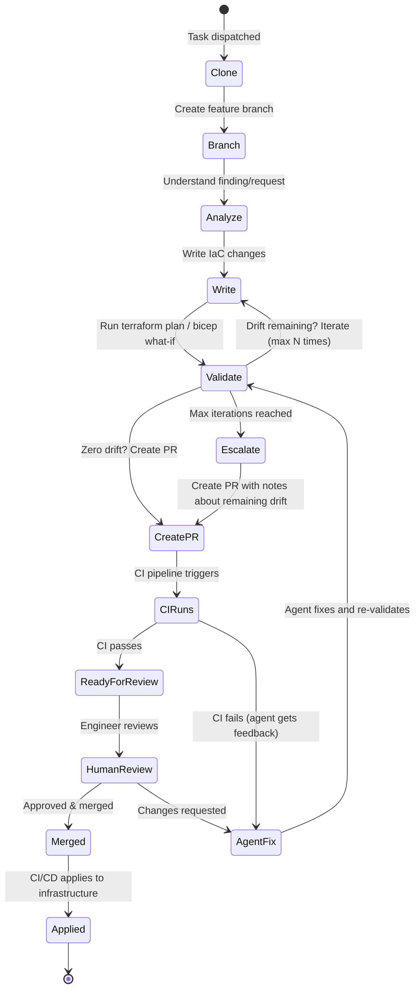

# Chapter 7: Change Control & GitOps

> PR-based workflows, drift verification loops, and validation gates.

---

## The Golden Rule (Again)

```
Agent writes code → Agent creates PR → CI validates → Human reviews → CI applies
```

Treat this as a hard architectural constraint, not a guideline.

---

## Why PR-Based Change Control

| Without PR workflow | With PR workflow |
|--------------------|-----------------|
| Agent applies directly to prod | Agent produces a reviewable diff |
| No audit trail of what changed | Full git history of every change |
| No rollback path | `git revert` restores previous state |
| No human checkpoint | Human reviews before merge |
| Hard to understand agent reasoning | PR description explains the why |
| One bad decision = outage | One bad decision = closed PR |

---

## The Agent PR Lifecycle



---

## Pre-PR Validation Loop

The most important pattern: **never create a PR without validating the changes first**.

```typescript
async function validateAndCreatePR(
  context: AgentContext,
  maxIterations: number = 10
): Promise<PRResult> {
  for (let i = 0; i < maxIterations; i++) {
    // 1. Run the IaC validation pipeline
    const planResult = await triggerPipeline(context.pipelineId, 'PLAN');

    // 2. Check for remaining drift
    if (planResult.driftResources.length === 0) {
      // No drift — safe to create PR
      return await createPullRequest(context, {
        title: `fix: ${context.findingTitle}`,
        body: formatPRBody(context, planResult),
        validationPassed: true,
        iterations: i + 1,
      });
    }

    // 3. Feed plan output back to agent for correction
    const feedback = formatDriftFeedback(planResult);
    await agentSession.continue(
      `Plan shows ${planResult.driftResources.length} remaining drift items:\n${feedback}\n` +
      `Please fix these issues. Iteration ${i + 1}/${maxIterations}.`
    );
  }

  // Max iterations reached — create PR anyway with documentation
  return await createPullRequest(context, {
    title: `fix: ${context.findingTitle} (needs review)`,
    body: formatPRBody(context, lastPlanResult, {
      note: `Agent reached max iterations (${maxIterations}). Remaining drift documented below.`,
    }),
    validationPassed: false,
    iterations: maxIterations,
  });
}
```

---

## Deterministic Validation: Don't Trust the LLM Alone

LLMs generate plausible-looking IaC, but they hallucinate resource names, invent nonexistent arguments, and ignore cost implications. The fix: run deterministic tools on every generated change before creating the PR. These tools return hard pass/fail results — no probability, no "I think this is correct."

The agent should chain these checks in order, failing fast on the first error:

```
terraform fmt -check     ← formatting
       │
terraform validate       ← syntax & type errors
       │
tflint                   ← provider-specific rules (invalid AMI, wrong region)
       │
checkov / trivy          ← security misconfigurations (CIS, NIST, PCI-DSS)
       │
conftest                 ← custom org policies (OPA/Rego)
       │
infracost                ← cost estimate (flag if > budget threshold)
       │
terraform plan           ← actual cloud API dry-run (catches runtime errors)
       │
access analyzer          ← IAM policy validation (AWS) / policy compliance (Azure)
```

Each step exits non-zero on failure. The agent reads the error output, fixes the issue, and reruns — this is the iteration loop from the previous section, but with much richer feedback than just "plan failed."

### Open-Source Validation Tools

#### Security & Compliance Scanning

Run these against generated `.tf`, `.yaml`, `.bicep`, or `.json` files before they reach a PR:

| Tool | What It Catches | Scans | Stars |
|------|----------------|-------|-------|
| [Checkov](https://github.com/bridgecrewio/checkov) | 1,000+ security policies (CIS, NIST, PCI-DSS, HIPAA) | Terraform, CloudFormation, Bicep, Kubernetes, Helm, Dockerfile | ~8.5k |
| [Trivy](https://github.com/aquasecurity/trivy) (IaC mode) | Misconfigurations, vulnerabilities, secrets in IaC files | Terraform, CloudFormation, Bicep, Kubernetes, Dockerfile | ~32k |
| [Prowler](https://github.com/prowler-cloud/prowler) | Cloud account posture (CIS, SOC2, GDPR, HIPAA) — runs against live accounts | AWS, Azure, GCP, Kubernetes | ~12k |
| [KICS](https://github.com/Checkmarx/kics) | 2,400+ queries for IaC misconfigurations | Terraform, CloudFormation, Ansible, Kubernetes, Pulumi, CDK | ~2.5k |
| [Terrascan](https://github.com/tenable/terrascan) | 500+ OPA/Rego-based policies covering CIS benchmarks | Terraform, Kubernetes, Helm, CloudFormation, Dockerfile | ~5.2k |
| [ScoutSuite](https://github.com/nccgroup/ScoutSuite) | Multi-cloud security audit (gathers config via cloud APIs) | AWS, Azure, GCP, Alibaba, Oracle Cloud | ~7.2k |
| [Semgrep](https://github.com/semgrep/semgrep) | Custom pattern-matching rules (flexible, write your own) | 30+ languages including HCL | ~14k |

**Agent usage**: `checkov -d . --framework terraform --compact --quiet` or `trivy config . --exit-code 1`. Parse the JSON output, feed failures back into the agent context, iterate.

#### Cost Estimation

| Tool | What It Does | Stars |
|------|-------------|-------|
| [Infracost](https://github.com/infracost/infracost) | Shows monthly cost estimate for Terraform changes; diffs against current state | ~11k |
| [OpenCost](https://github.com/opencost/opencost) | Real-time Kubernetes workload cost allocation (CNCF incubating) | ~6.4k |

**Agent usage**: `infracost breakdown --path . --format json`. Check `totalMonthlyCost` against a budget threshold. Include the estimate in the PR body so reviewers see cost impact.

Cloud providers also expose pricing APIs for custom cost checks:
- **AWS**: [Pricing API](https://docs.aws.amazon.com/awsaccountbilling/latest/aboutv2/price-changes.html) — programmatic access to service prices
- **Azure**: [Retail Prices API](https://learn.microsoft.com/en-us/rest/api/cost-management/retail-prices/azure-retail-prices) — unauthenticated REST API, no subscription required
- **GCP**: [Cloud Billing Catalog API](https://cloud.google.com/billing/docs/reference/rest) — lists all services and SKUs with pricing

#### Linting & Formatting

| Tool | What It Catches | Stars |
|------|----------------|-------|
| [TFLint](https://github.com/terraform-linters/tflint) | Errors `terraform plan` misses — invalid AMI IDs, deprecated arguments, provider-specific rules | ~5.6k |
| [cfn-lint](https://github.com/aws-cloudformation/cfn-lint) | CloudFormation template errors (schema, best practices, custom rules) | ~2.6k |
| [terraform-docs](https://github.com/terraform-docs/terraform-docs) | Missing module documentation, incomplete input/output descriptions | ~4.6k |
| [Terratag](https://github.com/env0/terratag) | Missing tags on resources (enforces tagging policies) | ~1k |
| [Pike](https://github.com/JamesWoolfenden/pike) | Calculates minimum IAM permissions required to apply generated code | ~800 |
| `terraform fmt -check` | Canonical formatting | built-in |
| `terraform validate` | Syntax and internal consistency (no provider calls) | built-in |
| `az bicep lint` | Bicep syntax errors and best practice violations | built-in |

#### Policy-as-Code Engines

Write your own org-specific rules and enforce them on every generated change:

| Tool | What It Does | Stars |
|------|-------------|-------|
| [OPA](https://github.com/open-policy-agent/opa) | General-purpose policy engine (Rego language). CNCF graduated. | ~11.2k |
| [Conftest](https://github.com/open-policy-agent/conftest) | Run OPA/Rego policies against Terraform plan JSON, Kubernetes manifests, Dockerfiles | ~3.1k |
| [Kyverno](https://github.com/kyverno/kyverno) | Kubernetes-native policy engine (YAML policies, no Rego). CNCF graduated. | ~7.4k |
| [Cloud Custodian](https://github.com/cloud-custodian/cloud-custodian) | YAML-based rules engine for cloud security, cost, and governance (CNCF incubating) | ~5.8k |

**Agent usage**: `terraform show -json plan.tfplan | conftest test -` runs your Rego policies against the actual plan output — not just the source files but the resolved plan with all variables expanded.

#### Drift Detection

| Tool | What It Does | Stars |
|------|-------------|-------|
| `terraform plan -refresh-only` | Detects drift between Terraform state and actual cloud resources | built-in |
| [Terramate](https://github.com/terramate-io/terramate) | IaC orchestration with built-in drift detection and Slack notifications | ~3.4k |
| [driftctl](https://github.com/snyk/driftctl) | Compares Terraform state with actual cloud resources (maintenance mode) | ~2.4k |
| [cloud-nuke](https://github.com/gruntwork-io/cloud-nuke) | Deletes orphaned resources in cloud accounts (cleanup tool) | ~3.1k |

### Cloud Provider Validation APIs

These APIs let agents validate generated code against the actual cloud environment — catching errors that static analysis cannot (quota limits, naming conflicts, permission issues).

#### AWS

| API | What It Validates |
|-----|------------------|
| [IAM Access Analyzer — ValidatePolicy](https://docs.aws.amazon.com/access-analyzer/latest/APIReference/API_ValidatePolicy.html) | Checks IAM policy JSON against grammar and best practices. Returns security warnings and errors. |
| [IAM Access Analyzer — CheckNoNewAccess](https://docs.aws.amazon.com/access-analyzer/latest/APIReference/API_CheckNoNewAccess.html) | Compares new IAM policy against existing one. Returns PASS/FAIL on whether new access is introduced. |
| [IAM Policy Simulator](https://docs.aws.amazon.com/IAM/latest/APIReference/API_SimulateCustomPolicy.html) | Simulates whether a policy allows or denies specific API actions — test before deploying. |
| [Config — StartResourceEvaluation](https://docs.aws.amazon.com/config/latest/APIReference/API_StartResourceEvaluation.html) | Evaluates a resource config against Config rules *before* the resource exists — proactive compliance. |
| [CloudFormation Change Sets](https://docs.aws.amazon.com/AWSCloudFormation/latest/APIReference/API_CreateChangeSet.html) | Preview stack changes without deploying. Catches invalid properties, name conflicts, S3 constraints. |
| [Trusted Advisor API](https://docs.aws.amazon.com/awssupport/latest/user/get-started-with-aws-trusted-advisor-api.html) | Cost optimization, security, fault tolerance, service limits. Requires Business Support+. |

#### Azure

| API | What It Validates |
|-----|------------------|
| [ARM/Bicep What-If](https://learn.microsoft.com/en-us/azure/azure-resource-manager/bicep/deploy-what-if) | Predicts resource changes without deploying. `az deployment group what-if` works for Bicep and ARM. |
| [Policy Compliance API](https://learn.microsoft.com/en-us/azure/governance/policy/how-to/get-compliance-data) | Query compliance states across subscriptions and management groups via `PolicyStates` operations. |
| [Advisor REST API](https://learn.microsoft.com/en-us/rest/api/advisor/) | Security, performance, cost, reliability recommendations. Check if generated resources trigger warnings. |
| [Resource Graph](https://learn.microsoft.com/en-us/rest/api/azure-resourcegraph/) | Query resources at scale with KQL. Check for naming conflicts and existing resources before generating code. |

#### GCP

| API | What It Validates |
|-----|------------------|
| [Policy Analyzer](https://docs.cloud.google.com/policy-intelligence/docs/policy-analyzer-overview) | Analyzes IAM access relationships — "who has access to what" for validating generated IAM bindings. |
| [Recommender API](https://docs.cloud.google.com/recommender/docs/reference/rest) | Cost, security, performance recommendations. Check generated resources against GCP best practices. |
| [Cloud Asset Inventory](https://docs.cloud.google.com/asset-inventory/docs/reference/rest) | Search existing resources, check naming conflicts, understand current state before generating code. |
| [Security Command Center](https://docs.cloud.google.com/security-command-center/docs/reference/rest) | Security findings across GCP. Check for known vulnerabilities in the infrastructure being generated. |

#### OCI

| API | What It Validates |
|-----|------------------|
| [Cloud Guard](https://docs.oracle.com/en-us/iaas/cloud-guard/using/index.htm) | Security posture monitoring with detector and responder recipes. |
| [Cloud Advisor](https://docs.oracle.com/en-us/iaas/Content/CloudAdvisor/Concepts/cloudadvisoroverview.htm) | Cost optimization and security recommendations. |

### Why This Matters for Agent Quality

LLMs are good at generating structurally correct IaC. They are bad at:
- Knowing current cloud pricing (training data is months old)
- Checking if a resource name already exists in your account
- Verifying IAM policies actually grant the intended access
- Remembering your organization's specific compliance requirements

Deterministic tools fill these gaps. The agent generates the code; the tools verify it. When a tool fails, the agent gets specific, parseable error output — much better feedback than "the plan failed." This is how you get from "AI-generated IaC" to "AI-generated IaC that passes the same CI checks as human-written code."

---

## Multi-Environment Validation (Matrix Pipelines)

Infrastructure often spans multiple environments. A single pipeline run can produce artifacts for dev, staging, and prod:

```typescript
interface PipelineResult {
  runId: string;
  status: 'success' | 'failure';
  // Matrix dimensions (environments)
  dimensions?: string[];  // e.g., ['dev', 'staging', 'prod']
  outputs: {
    plan: {
      // Flat (single environment)
      parsed?: PlanOutput;
      // Or per-dimension
      [dimension: string]: { parsed: PlanOutput } | undefined;
    };
  };
}

// Check all dimensions for drift
function hasRemainingDrift(result: PipelineResult): boolean {
  if (result.dimensions?.length) {
    return result.dimensions.some(dim => {
      const output = result.outputs.plan[dim]?.parsed;
      return output?.driftResources?.length > 0;
    });
  }
  return (result.outputs.plan.parsed?.driftResources?.length ?? 0) > 0;
}
```

---

## PR Body Format

Give reviewers full context in the PR body:

```markdown
## Summary
Fixes compliance finding: S3 bucket `my-bucket` missing server-side encryption.

## Changes
- Added `server_side_encryption_configuration` block to `modules/storage/main.tf`
- Set default encryption to `aws:kms` with auto-generated key

## Validation
- Terraform plan: **PASSED** (0 drift remaining)
- Iterations: 2 (first attempt had syntax error)
- Environment: production

## Plan Output
```hcl
# aws_s3_bucket.my_bucket will be updated in-place
~ resource "aws_s3_bucket" "my_bucket" {
    + server_side_encryption_configuration {
        + rule {
            + apply_server_side_encryption_by_default {
                + sse_algorithm = "aws:kms"
              }
          }
      }
  }
```

## Finding Details
- Source: Prowler
- Severity: HIGH
- Framework: CIS AWS Benchmark v3.0
- Control: 2.1.1 - Ensure S3 bucket has server-side encryption enabled

```

---

## CI/CD Integration Patterns

### GitHub Actions

```yaml
# .github/workflows/terraform-plan.yml
name: Terraform Plan
on:
  pull_request:
    paths: ['**/*.tf', '**/*.tfvars']

jobs:
  plan:
    runs-on: ubuntu-latest
    permissions:
      pull-requests: write
      id-token: write  # For OIDC auth
    steps:
      - uses: actions/checkout@v4
      - uses: hashicorp/setup-terraform@v3

      - name: Terraform Init
        run: terraform init

      - name: Terraform Plan
        id: plan
        run: terraform plan -out=plan.tfplan -json > plan.json

      - name: Upload Plan Artifact
        uses: actions/upload-artifact@v4
        with:
          name: terraform-plan
          path: plan.json

      - name: Comment PR
        uses: actions/github-script@v7
        with:
          script: |
            const plan = require('./plan.json');
            // Post plan summary as PR comment
```

### GitLab CI

```yaml
# .gitlab-ci.yml
terraform-plan:
  stage: validate
  image: hashicorp/terraform:1.9
  script:
    - terraform init
    - terraform plan -out=plan.tfplan
    - terraform show -json plan.tfplan > plan.json
  artifacts:
    paths: [plan.json]
    expire_in: 1 hour
  rules:
    - if: '$CI_PIPELINE_SOURCE == "merge_request_event"'
      changes: ['**/*.tf', '**/*.tfvars']
```

### Atlantis (Dedicated Terraform CI)

```yaml
# atlantis.yaml
version: 3
projects:
  - dir: infrastructure/
    autoplan:
      when_modified: ['**/*.tf', '**/*.tfvars']
      enabled: true
    workflow: default
    apply_requirements: [approved, mergeable]

workflows:
  default:
    plan:
      steps:
        - init
        - plan:
            extra_args: ["-json"]
    apply:
      steps:
        - apply
```

### Spacelift

```yaml
# .spacelift/config.yml
version: "1"
stacks:
  production:
    project_root: infrastructure/
    terraform_version: "1.9.0"
    auto_apply: false  # Require manual approval
    before_plan:
      - checkov -d . --framework terraform
```

---

## Branch Naming Conventions

Keep agent branches identifiable and organized. A common pattern:

```
agent/{agent-type}/{task-reference}/{unique-suffix}
```

Examples:
- `agent/remediation/finding-abc123/m4k7x2`
- `agent/drift-fix/vpc-encryption/a9b3c1`
- `agent/pr-review/issue-456/x2y4z6`

The `agent/` prefix makes it easy to filter agent-created branches in CI rules, branch protection, and cleanup scripts. The unique suffix prevents collisions when agents work on the same finding concurrently.
```

---

## Hard Rules (System Prompt Constraints)

Encode safety rules directly into the agent's system prompt:

```markdown
## Hard Rules — NEVER violate these

1. NEVER push directly to main or master branch
2. NEVER run `terraform apply` or `az deployment create` — only plan/what-if
3. NEVER create a PR until the validation pipeline shows zero drift
4. ALWAYS create a new branch for changes
5. ALWAYS include the finding ID and validation results in the PR body
6. If you reach 10 plan iterations without zero drift, create the PR anyway
   with full documentation of remaining drift
7. NEVER modify files outside the repository's IaC directories
8. ALWAYS commit with a descriptive message referencing the finding
```

---

## Next Chapter

[Chapter 8: Policy & Guardrails →](./08-policy-guardrails.md)
