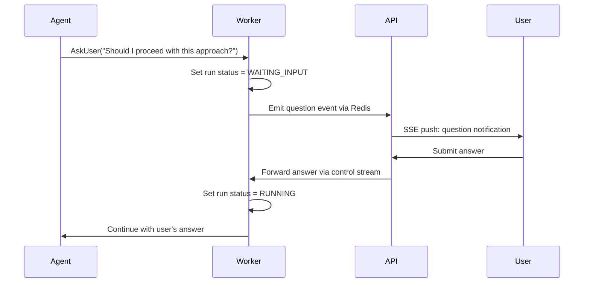

# Chapter 7: Policy & Guardrails

> Tool restrictions, approval gates, autonomy tiers, and organizational policy enforcement.

---

## The Policy Plane

Policy is **the real product** in an infrastructure agent system. The LLM decides *what* to do; policy decides *whether it's allowed*. Without policy, you have a very expensive way to create incidents.

---

## Three Layers of Guardrails

```
┌──────────────────────────────────────────────────┐
│  Layer 1: STRUCTURAL GUARDRAILS                  │
│  Built into the architecture. Cannot be bypassed.│
│  • Workers can't access DB                       │
│  • Sandbox containers have network restrictions  │
│  • Credential broker validates every request     │
│  • Max iteration limits enforced in code         │
└──────────────────┬───────────────────────────────┘
                   │
┌──────────────────▼───────────────────────────────┐
│  Layer 2: PROMPT-LEVEL RULES                     │
│  Encoded in system prompts. Model-enforced.      │
│  • "Never push to main"                         │
│  • "Always validate before PR"                   │
│  • "Max 10 drift iterations"                     │
│  • Organization-specific policies                │
└──────────────────┬───────────────────────────────┘
                   │
┌──────────────────▼───────────────────────────────┐
│  Layer 3: RUNTIME POLICY ENGINE                  │
│  Evaluated at dispatch and tool-call time.       │
│  • Tool allow/deny lists                         │
│  • Autonomy tier enforcement                     │
│  • Human approval requirements                   │
│  • Budget/rate limits                            │
└──────────────────────────────────────────────────┘
```

**Important**: Never rely on a single layer. Layer 2 (prompt rules) is the weakest — models can be manipulated. Layers 1 and 3 must catch what Layer 2 misses.

---

## Autonomy Tiers in Practice

```typescript
enum AutonomyTier {
  OBSERVE = 0,     // Read-only. Can analyze, summarize, recommend.
  RECOMMEND = 1,   // Can suggest changes but not execute.
  DRAFT = 2,       // Can create PRs. No direct execution.
  SANDBOX = 3,     // Can execute in isolated sandbox.
  PROD_GATED = 4,  // Can execute in prod WITH human approval.
}

interface AgentPermissions {
  tier: AutonomyTier;
  allowedTools: string[];
  deniedTools: string[];
  maxTurns: number;
  maxTokenBudget: number;
  requiresApproval: {
    prCreation: boolean;
    credentialRequest: boolean;
    productionAccess: boolean;
  };
}

// Example tier mappings
const TIER_DEFAULTS: Record<AutonomyTier, Partial<AgentPermissions>> = {
  [AutonomyTier.OBSERVE]: {
    allowedTools: ['read-file', 'git-diff', 'describe-resource', 'query-logs'],
    deniedTools: ['write-file', 'git-push', 'create-pr', 'cloud-credentials'],
    requiresApproval: { prCreation: true, credentialRequest: true, productionAccess: true },
  },
  [AutonomyTier.DRAFT]: {
    allowedTools: [], // All tools
    deniedTools: ['terraform-apply', 'kubectl-apply'],
    requiresApproval: { prCreation: false, credentialRequest: false, productionAccess: true },
  },
  [AutonomyTier.PROD_GATED]: {
    allowedTools: [],
    deniedTools: [],
    requiresApproval: { prCreation: false, credentialRequest: false, productionAccess: true },
  },
};
```

---

## Organization-Level Policies

Organizations define policies in plain language. These are injected into the agent context at dispatch time:

```typescript
// Policy stored in database
interface CustomPolicy {
  id: string;
  name: string;
  content: string;       // Markdown — human-readable
  isActive: boolean;
  version: number;
  organizationId: string;
}

// Example policies
const examplePolicies = [
  {
    name: 'No Production Direct Changes',
    content: `
## Policy: No Direct Production Changes
- All changes to production environments MUST go through a pull request
- The PR MUST pass all CI checks before merge
- Production PRs require approval from a senior engineer
- Emergency changes follow the break-glass procedure documented in the runbook
    `,
  },
  {
    name: 'Encryption Requirements',
    content: `
## Policy: Encryption at Rest
- All S3 buckets MUST have server-side encryption enabled (SSE-KMS preferred)
- All RDS instances MUST have storage encryption enabled
- All EBS volumes MUST be encrypted
- When fixing encryption findings, use the organization's KMS key: alias/infra-key
    `,
  },
  {
    name: 'Naming Conventions',
    content: `
## Policy: Resource Naming
- All resources follow the pattern: {env}-{service}-{resource_type}
- Examples: prod-api-rds, staging-web-s3, dev-auth-lambda
- Tags required: Environment, Service, Owner, CostCenter, ManagedBy=terraform
    `,
  },
];
```

### Policy Digest Injection

Before dispatching an agent, compile all active policies into a single document:

```typescript
async function buildPolicyDigest(organizationId: string): Promise<string> {
  const policies = await db.customPolicy.findMany({
    where: { organizationId, isActive: true, deletedAt: null },
    orderBy: { name: 'asc' },
  });

  if (policies.length === 0) return '';

  const digest = [
    '# Organization Policies',
    '',
    'You MUST follow these policies when making changes:',
    '',
    ...policies.map(p => p.content),
  ].join('\n');

  return digest;
}

// Injected into the agent payload at dispatch time
const payload = {
  prompt: userMessage,
  systemPrompt: agentConfig.systemPrompt,
  policyDigest: await buildPolicyDigest(org.id),
  // ...
};
```

---

## Human-in-the-Loop (HITL) Checkpoints

When the agent reaches a decision point that requires human input:



```typescript
// Agent skill: pause for human input
export async function askUser(question: string, options?: string[]): Promise<string> {
  const response = await fetch('http://localhost:3000/ask-user', {
    method: 'POST',
    headers: { 'Content-Type': 'application/json' },
    body: JSON.stringify({ question, options }),
  });
  return response.json().then(r => r.answer);
}

// Internal server handler
async function handleAskUser(req: Request): Promise<Response> {
  const { question, options } = await req.json();

  // Emit question event to Redis (picked up by SSE)
  await emitEvent(currentRunId, {
    type: 'question',
    data: { question, options, timestamp: Date.now() },
  });

  // Wait for response on control channel
  const answer = await waitForControl(currentRunId, 'user_response', {
    timeoutMs: 24 * 60 * 60 * 1000, // 24h timeout
  });

  return Response.json({ answer });
}
```

---

## Budget & Rate Limits

Prevent runaway loops and cost explosions:

```typescript
interface AgentBudget {
  maxTurns: number;          // LLM round-trips (e.g., 50)
  maxTokens: number;         // Total token budget (e.g., 500_000)
  maxToolCalls: number;      // Total tool invocations (e.g., 200)
  maxDurationMs: number;     // Wall clock limit (e.g., 30 min)
  maxPipelineRuns: number;   // CI/CD pipeline triggers (e.g., 15)
  maxCredentialRequests: number;  // Token minting (e.g., 10)
}

// Enforce during execution
class BudgetTracker {
  private turns = 0;
  private tokens = 0;
  private toolCalls = 0;
  private startTime = Date.now();

  check(budget: AgentBudget): void {
    if (this.turns >= budget.maxTurns)
      throw new BudgetExceededError('Max turns reached');
    if (this.tokens >= budget.maxTokens)
      throw new BudgetExceededError('Token budget exhausted');
    if (Date.now() - this.startTime >= budget.maxDurationMs)
      throw new BudgetExceededError('Time limit exceeded');
  }

  recordTurn(tokensUsed: number) { this.turns++; this.tokens += tokensUsed; }
  recordToolCall() { this.toolCalls++; }
}
```

---

## Key Takeaways

1. **Three layers of defense** — structural, prompt-level, and runtime policy
2. **Autonomy tiers** bind risk level to permissions
3. **Organization policies** in plain language, injected at dispatch time
4. **HITL checkpoints** for high-impact decisions
5. **Hard budgets** on turns, tokens, time, and tool calls — enforced in code, not prompts

---

## Next Chapter

[Chapter 8: Observability & Audit →](./08-observability.md)
