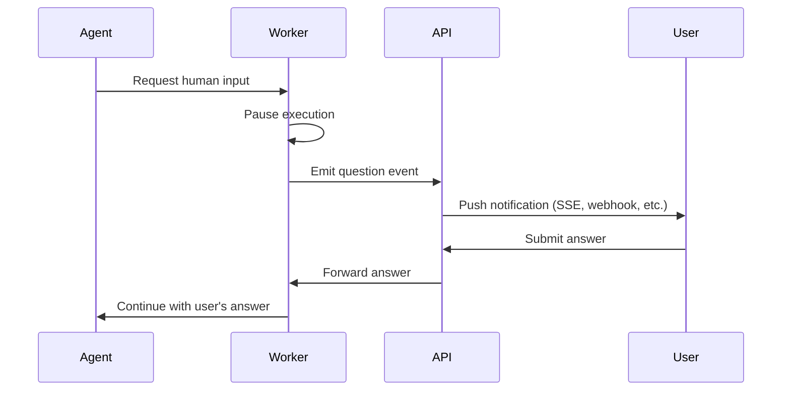

# Chapter 8: Policy & Guardrails

> Tool restrictions, approval gates, autonomy tiers, and organizational policy enforcement.

---

## The Policy Plane

Policy determines what the agent is actually allowed to do. The LLM decides *what* to do; policy decides *whether it's allowed*.

---

## Three Layers of Guardrails

```
┌────────────────────────────────────────────────────┐
│  Layer 1: STRUCTURAL GUARDRAILS                    │
│  Built into architecture. Cannot be bypassed.      │
│  • Workers can't access DB                         │
│  • Sandbox containers have network restrictions    │
│  • Credential broker validates every request       │
│  • Max iteration limits enforced in code           │
└───────────────────────┬────────────────────────────┘
                        │
┌───────────────────────▼────────────────────────────┐
│  Layer 2: PROMPT-LEVEL RULES                       │
│  Encoded in system prompts. Model-enforced.        │
│  • "Never push to main"                            │
│  • "Always validate before PR"                     │
│  • "Max 10 drift iterations"                       │
│  • Organization-specific policies                  │
└───────────────────────┬────────────────────────────┘
                        │
┌───────────────────────▼────────────────────────────┐
│  Layer 3: RUNTIME POLICY ENGINE                    │
│  Evaluated at dispatch and tool-call time.         │
│  • Tool allow/deny lists                           │
│  • Autonomy tier enforcement                       │
│  • Human approval requirements                     │
│  • Budget/rate limits                              │
└────────────────────────────────────────────────────┘
```

Layer 2 (prompt rules) is the weakest — models can be manipulated. Layers 1 and 3 must catch what Layer 2 misses.

---

## Autonomy Tiers in Practice

Define graduated levels of autonomy. A five-tier model covers most use cases:

| Tier | Name | What the Agent Can Do | Approval Required |
|------|------|----------------------|-------------------|
| 0 | **Observe** | Read-only. Analyze, summarize, recommend. | N/A |
| 1 | **Recommend** | Suggest changes but not execute them. | N/A |
| 2 | **Draft** | Create PRs. No direct execution. | PR review only |
| 3 | **Sandbox** | Execute in isolated sandbox. | Credential requests |
| 4 | **Prod (gated)** | Execute in prod with human approval gate. | All production actions |

Each tier maps to a set of allowed tools, denied tools, and approval requirements:

```typescript
// Example: tier-to-permissions mapping
const tierPermissions = {
  observe: {
    allowedTools: ['read-file', 'git-diff', 'describe-resource', 'query-logs'],
    deniedTools: ['write-file', 'git-push', 'create-pr', 'cloud-credentials'],
  },
  draft: {
    allowedTools: ['*'],
    deniedTools: ['terraform-apply', 'kubectl-apply'],
  },
  prod_gated: {
    allowedTools: ['*'],
    deniedTools: [],
    requiresApproval: ['production-access'],
  },
};
```

---

## Organization-Level Policies

Organizations define policies in plain language (typically markdown). These are stored with version history, toggled on/off, and injected into the agent context at dispatch time.

Example policies:

```markdown
## Policy: No Direct Production Changes
- All changes to production environments MUST go through a pull request
- The PR MUST pass all CI checks before merge
- Production PRs require approval from a senior engineer
- Emergency changes follow the break-glass procedure documented in the runbook
```

```markdown
## Policy: Encryption at Rest
- All S3 buckets MUST have server-side encryption enabled (SSE-KMS preferred)
- All RDS instances MUST have storage encryption enabled
- All EBS volumes MUST be encrypted
- When fixing encryption findings, use the organization's KMS key: alias/infra-key
```

```markdown
## Policy: Resource Naming
- All resources follow the pattern: {env}-{service}-{resource_type}
- Examples: prod-api-rds, staging-web-s3, dev-auth-lambda
- Tags required: Environment, Service, Owner, CostCenter, ManagedBy=terraform
```

### Policy Digest Injection

Before dispatching an agent, compile all active policies into a single document and include it in the agent's system prompt or context. The agent reads these as hard constraints — not suggestions.

The key requirement: policies must be **versioned** (so you can diff what changed), **auditable** (who edited, when), and **plain language** (so the person debugging agent behavior can read them without learning Rego or Sentinel).

---

## Human-in-the-Loop (HITL) Checkpoints

When the agent reaches a decision point that requires human input:



The implementation pattern:
1. Agent calls a "request input" tool with a question and optional choices
2. Worker pauses execution and emits a question event to the notification system
3. User receives the question (via web UI, Slack, email) and responds
4. Worker receives the answer on a control channel and resumes the agent
5. A timeout (e.g., 24 hours) auto-fails the request if no human responds

The key design decision: **how does the worker wait?** Options include blocking on a Redis pub/sub channel, polling a database, or using a workflow engine (Temporal, Inngest) that natively supports human-in-the-loop pauses.

---

## Budget & Rate Limits

Prevent runaway loops and cost explosions:

```typescript
interface AgentBudget {
  maxTurns: number;          // LLM round-trips (e.g., 50)
  maxTokens: number;         // Total token budget (e.g., 500_000)
  maxToolCalls: number;      // Total tool invocations (e.g., 200)
  maxDurationMs: number;     // Wall clock limit (e.g., 30 min)
  maxPipelineRuns: number;   // CI/CD pipeline triggers (e.g., 15)
  maxCredentialRequests: number;  // Token minting (e.g., 10)
}

// Enforce during execution
class BudgetTracker {
  private turns = 0;
  private tokens = 0;
  private toolCalls = 0;
  private startTime = Date.now();

  check(budget: AgentBudget): void {
    if (this.turns >= budget.maxTurns)
      throw new BudgetExceededError('Max turns reached');
    if (this.tokens >= budget.maxTokens)
      throw new BudgetExceededError('Token budget exhausted');
    if (Date.now() - this.startTime >= budget.maxDurationMs)
      throw new BudgetExceededError('Time limit exceeded');
  }

  recordTurn(tokensUsed: number) { this.turns++; this.tokens += tokensUsed; }
  recordToolCall() { this.toolCalls++; }
}
```

---

## Next Chapter

[Chapter 9: Observability & Audit →](./09-observability.md)
