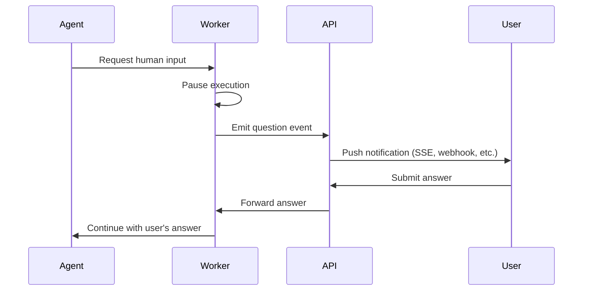

# Chapter 8: Policy & Guardrails

> Tool restrictions, approval gates, autonomy tiers, policy-as-code generation, and organizational policy enforcement.

---

## The Policy Plane

Policy determines what the agent is actually allowed to do. The LLM decides *what* to do; policy decides *whether it's allowed*.

This chapter covers the full policy stack: from structural constraints the agent can't bypass, through prompt-level rules that guide its behavior, to runtime enforcement that validates every action — and crucially, how agents can **generate enforceable policy** from soft rules, closing the loop between human intent and machine enforcement.

---

## Three Layers of Guardrails

```
┌────────────────────────────────────────────────────┐
│  Layer 1: STRUCTURAL GUARDRAILS                    │
│  Built into architecture. Cannot be bypassed.      │
│  • Workers can't access DB                         │
│  • Sandbox containers have network restrictions    │
│  • Credential broker validates every request       │
│  • Max iteration limits enforced in code           │
└───────────────────────┬────────────────────────────┘
                        │
┌───────────────────────▼────────────────────────────┐
│  Layer 2: PROMPT-LEVEL RULES                       │
│  Encoded in system prompts. Model-enforced.        │
│  • "Never push to main"                            │
│  • "Always validate before PR"                     │
│  • "Max 10 drift iterations"                       │
│  • Organization-specific policies                  │
└───────────────────────┬────────────────────────────┘
                        │
┌───────────────────────▼────────────────────────────┐
│  Layer 3: RUNTIME POLICY ENGINE                    │
│  Evaluated at dispatch and tool-call time.         │
│  • Tool allow/deny lists                           │
│  • Autonomy tier enforcement                       │
│  • Human approval requirements                     │
│  • Budget/rate limits                              │
└────────────────────────────────────────────────────┘
```

Layer 2 (prompt rules) is the weakest — models can be manipulated. Layers 1 and 3 must catch what Layer 2 misses. But Layer 2 has a unique superpower: it's the only layer that understands *intent*. The model can read a policy like "all S3 buckets must be encrypted" and generate the Terraform, the Azure Policy definition, or the OPA rule to enforce it structurally. This is how soft guardrails become hard guardrails — the agent itself closes the gap.

---

## Tool Allow/Deny Lists

Every agent type should have an explicit list of tools it can and cannot use. This is a structural guardrail — enforced at the runtime level, not the prompt level.

```yaml
# Example: tool permissions per agent type
agent_types:
  compliance-scanner:
    allowed_tools:
      - read-file
      - git-diff
      - git-log
      - describe-resource
      - list-resources
      - query-findings
    denied_tools:
      - write-file
      - git-push
      - git-commit
      - terraform-apply
      - kubectl-apply
      - cloud-credentials:write

  remediation-agent:
    allowed_tools:
      - read-file
      - write-file
      - git-checkout
      - git-commit
      - git-push
      - create-pr
      - describe-resource
      - list-resources
      - terraform-plan       # Can plan, not apply
    denied_tools:
      - terraform-apply
      - kubectl-apply
      - cloud-credentials:write

  drift-agent:
    allowed_tools:
      - read-file
      - write-file
      - git-checkout
      - git-commit
      - git-push
      - create-pr
      - terraform-plan
      - terraform-show
    denied_tools:
      - terraform-apply
      - terraform-destroy    # Explicit deny — never
```

Enforce tool lists at the runtime level, not the prompt level. When the agent calls a denied tool, the runtime rejects the call before it executes — no matter what the LLM was instructed to do.

```typescript
function executeToolCall(toolName: string, args: any, agentType: string): Result {
  const permissions = getToolPermissions(agentType);

  if (permissions.deniedTools.includes(toolName)) {
    return { error: `Tool '${toolName}' is denied for agent type '${agentType}'` };
  }

  if (!permissions.allowedTools.includes('*') &&
      !permissions.allowedTools.includes(toolName)) {
    return { error: `Tool '${toolName}' is not in the allow list` };
  }

  return tool.execute(args);
}
```

The deny list always wins. If a tool appears in both the allow and deny lists, it's denied. This prevents accidental permission grants when using wildcard allows.

---

## Autonomy Tiers in Practice

Define graduated levels of autonomy. A five-tier model covers most use cases:

| Tier | Name | What the Agent Can Do | Approval Required |
|------|------|----------------------|-------------------|
| 0 | **Observe** | Read-only. Analyze, summarize, recommend. | N/A |
| 1 | **Recommend** | Suggest changes but not execute them. | N/A |
| 2 | **Draft** | Create PRs. No direct execution. | PR review only |
| 3 | **Sandbox** | Execute in isolated sandbox. | Credential requests |
| 4 | **Prod (gated)** | Execute in prod with human approval gate. | All production actions |

Each tier maps to a set of allowed tools, denied tools, and approval requirements:

```typescript
// Example: tier-to-permissions mapping
const tierPermissions = {
  observe: {
    allowedTools: ['read-file', 'git-diff', 'describe-resource', 'query-logs'],
    deniedTools: ['write-file', 'git-push', 'create-pr', 'cloud-credentials'],
  },
  draft: {
    allowedTools: ['*'],
    deniedTools: ['terraform-apply', 'kubectl-apply'],
  },
  prod_gated: {
    allowedTools: ['*'],
    deniedTools: [],
    requiresApproval: ['production-access'],
  },
};
```

---

## Organization-Level Policies

Organizations define policies in plain language (typically markdown). These are stored with version history, toggled on/off, and injected into the agent context at dispatch time.

Example policies:

```markdown
## Policy: No Direct Production Changes
- All changes to production environments MUST go through a pull request
- The PR MUST pass all CI checks before merge
- Production PRs require approval from a senior engineer
- Emergency changes follow the break-glass procedure documented in the runbook
```

```markdown
## Policy: Encryption at Rest
- All S3 buckets MUST have server-side encryption enabled (SSE-KMS preferred)
- All RDS instances MUST have storage encryption enabled
- All EBS volumes MUST be encrypted
- When fixing encryption findings, use the organization's KMS key: alias/infra-key
```

```markdown
## Policy: Resource Naming
- All resources follow the pattern: {env}-{service}-{resource_type}
- Examples: prod-api-rds, staging-web-s3, dev-auth-lambda
- Tags required: Environment, Service, Owner, CostCenter, ManagedBy=terraform
```

### Policy Digest Injection

Before dispatching an agent, compile all active policies into a single document and include it in the agent's system prompt or context. The agent reads these as hard constraints — not suggestions.

The key requirement: policies must be **versioned** (so you can diff what changed), **auditable** (who edited, when), and **plain language** (so the person debugging agent behavior can read them without learning Rego or Sentinel).

---

## From Prompt Rules to Enforceable Policies

Here's the insight most teams miss: prompt-level policies don't have to stay soft. An agent that understands a natural-language policy can *generate* the enforceable policy code to make it structural.

```
┌───────────────────────────────────────────────────────────────────┐
│  POLICY GENERATION PIPELINE                                       │
│                                                                   │
│  Admin writes:                                                    │
│  "All S3 buckets must have server-side encryption (SSE-KMS)"      │
│                                                                   │
│         │                                                         │
│         ▼                                                         │
│  ┌──────────────┐    Agent reads the policy, understands intent,  │
│  │  Agent (LLM) │    and generates enforceable policy code:       │
│  └──────┬───────┘                                                 │
│         │                                                         │
│    ┌────┴─────────────────────────────────────────┐               │
│    │              │               │               │               │
│    ▼              ▼               ▼               ▼               │
│  Terraform     Azure Policy   AWS SCP /       OPA Rego /          │
│  resource      definition     Config Rule     Sentinel            │
│  validation                                                       │
│    │              │               │               │               │
│    └────┬─────────┴───────────────┴───────┬───────┘               │
│         ▼                                 ▼                       │
│    Pull Request                    Cloud-native                   │
│    (IaC change)                    enforcement                    │
│                                    (blocks non-compliant          │
│                                     deploys at the API level)     │
└───────────────────────────────────────────────────────────────────┘
```

This closes the loop: a human writes policy in plain language → the agent understands it → the agent generates enforceable policy code → the code goes through a PR → once merged, it becomes a structural guardrail that applies to *everyone*, not just the agent.

### What the Agent Can Generate

**AWS Service Control Policies (SCPs)** — Organization-wide deny rules:

```json
{
  "Version": "2012-10-17",
  "Statement": [{
    "Sid": "DenyUnencryptedS3",
    "Effect": "Deny",
    "Action": "s3:PutObject",
    "Resource": "*",
    "Condition": {
      "StringNotEquals": {
        "s3:x-amz-server-side-encryption": "aws:kms"
      }
    }
  }]
}
```

**AWS Config Rules** — Detect non-compliant resources:

```yaml
# Generated by agent from: "All RDS instances must have encryption enabled"
Resources:
  RdsEncryptionRule:
    Type: AWS::Config::ConfigRule
    Properties:
      ConfigRuleName: rds-storage-encrypted
      Source:
        Owner: AWS
        SourceIdentifier: RDS_STORAGE_ENCRYPTED
      Scope:
        ComplianceResourceTypes:
          - AWS::RDS::DBInstance
```

**Azure Policy definitions** — Enforce at the ARM layer:

```json
{
  "properties": {
    "displayName": "Require encryption on storage accounts",
    "policyType": "Custom",
    "mode": "All",
    "policyRule": {
      "if": {
        "allOf": [
          {
            "field": "type",
            "equals": "Microsoft.Storage/storageAccounts"
          },
          {
            "field": "Microsoft.Storage/storageAccounts/encryption.services.blob.enabled",
            "notEquals": true
          }
        ]
      },
      "then": {
        "effect": "deny"
      }
    }
  }
}
```

**GCP Organization Policies** — Constraints at the org/folder/project level:

```yaml
# Generated from: "All GCS buckets must be in US regions"
constraint: constraints/gcp.resourceLocations
listPolicy:
  allowedValues:
    - in:us-locations
```

**OPA / Rego** — General-purpose policy enforcement:

```rego
# Generated from: "No public S3 buckets"
package terraform.s3

deny[msg] {
  resource := input.resource_changes[_]
  resource.type == "aws_s3_bucket"
  resource.change.after.acl == "public-read"
  msg := sprintf("S3 bucket '%s' must not be public", [resource.name])
}

deny[msg] {
  resource := input.resource_changes[_]
  resource.type == "aws_s3_bucket_public_access_block"
  resource.change.after.block_public_acls != true
  msg := sprintf("S3 bucket '%s' must block public ACLs", [resource.name])
}
```

**HashiCorp Sentinel** — Policy-as-code for Terraform Cloud/Enterprise:

```python
# Generated from: "All resources must have required tags"
import "tfplan/v2" as tfplan

required_tags = ["Environment", "Service", "Owner", "CostCenter"]

main = rule {
  all tfplan.resource_changes as _, rc {
    all required_tags as tag {
      rc.change.after.tags contains tag
    }
  }
}
```

### The Feedback Loop

The real power is the feedback loop between soft and hard enforcement:

```
1. Admin writes policy         "All EBS volumes must be encrypted"
                                      │
2. Agent reads policy          Injected into system prompt
   and remediates              Agent finds unencrypted volumes, fixes Terraform
                                      │
3. Agent generates             Produces an AWS Config Rule or SCP
   enforceable policy          that prevents future violations
                                      │
4. Enforcement goes            Agent opens a PR with the policy-as-code
   through standard PR         Team reviews and merges
                                      │
5. Policy is now structural    Cloud provider blocks non-compliant resources
                               at the API level — no agent needed
                                      │
6. Future scans find           The class of violation is eliminated,
   zero violations             not just individual instances
```

This is how an organization matures: the agent starts by *following* policies and fixing violations one by one, and eventually *generates the enforcement* that prevents the class of violation from ever occurring again.

### When to Generate vs. When to Remediate

Not every prompt-level policy should become cloud-native enforcement. Use this decision guide:

| Policy Type | Remediate (fix resources) | Generate enforcement (prevent future) |
|-------------|:------------------------:|:------------------------------------:|
| Encryption requirements | Yes — fix existing | Yes — SCP/Azure Policy/Config Rule |
| Tagging standards | Yes — add missing tags | Yes — SCP or Azure Policy |
| Network exposure (public access) | Yes — close it | Yes — SCP or security group rules |
| Naming conventions | Yes — rename | Maybe — hard to enforce at API level |
| Architecture patterns | Yes — refactor IaC | No — too context-dependent |
| Cost optimization | Yes — resize/delete | No — requires judgment |
| Region restrictions | Yes — move resources | Yes — GCP Org Policy / SCP |

The rule of thumb: if the policy is **binary** (compliant or not, no judgment needed), generate enforcement. If it requires **context** (is this the right instance size? is this architecture correct?), keep it as a prompt-level rule.

---

## Pre-Execution Validation

Before the agent's changes land, validate them programmatically against policy. This is the last line of defense before a PR is created.

```
Agent generates changes
        │
        ▼
┌─────────────────────────┐
│  terraform plan         │──── Does the plan match expectations?
│  terraform validate     │     Any resource deletions?
└───────────┬─────────────┘     Any permission changes?
            │
            ▼
┌─────────────────────────┐
│  Policy-as-code check   │──── OPA/Rego, Sentinel, Checkov,
│  (against the plan)     │     tfsec, Trivy, custom rules
└───────────┬─────────────┘
            │
            ▼
┌─────────────────────────┐
│  Diff review            │──── Does the diff contain secrets?
│  (against the code)     │     Does it modify files outside scope?
└───────────┬─────────────┘     Does it exceed max lines changed?
            │
        ┌───┴───┐
        │       │
     Pass     Fail
        │       │
        ▼       ▼
   Create PR   Stop and report
                (log violation,
                 notify admin)
```

Run these checks **inside the agent loop**, not just in CI. The agent should catch violations before creating a PR, not after. This gives the agent a chance to self-correct:

1. Agent generates a Terraform change
2. Validation runs `checkov` or OPA against the plan
3. Checkov reports a violation (e.g., missing encryption)
4. Agent reads the violation, fixes the Terraform, and re-validates
5. Second pass succeeds — agent creates the PR

This self-correction loop is one of the biggest advantages agents have over static automation. A shell script that fails a policy check just fails. An agent that fails a policy check can read the error, understand what went wrong, and fix it.

---

## Policy Violation Response

When a policy violation is detected, the system needs a clear escalation path — not just "deny and log."

| Severity | Example | Response |
|----------|---------|----------|
| **Block** | Agent tries to use `terraform-destroy` | Deny the tool call. Log. Alert admin immediately. |
| **Escalate** | Agent wants write credentials for production | Pause execution. Request human approval. Resume or abort based on response. |
| **Warn** | Agent PR exceeds 500 lines changed | Allow but flag. Add warning label to PR. Notify reviewer. |
| **Audit** | Agent uses a tool not in its typical pattern | Allow. Log with extra detail. Include in daily digest. |

The escalation path should be configurable per organization. Some teams want strict blocking on everything; others want a lighter touch with audit-only for most violations. The policy engine should support both.

---

## Human-in-the-Loop (HITL) Checkpoints

When the agent reaches a decision point that requires human input:



The implementation pattern:
1. Agent calls a "request input" tool with a question and optional choices
2. Worker pauses execution and emits a question event to the notification system
3. User receives the question (via web UI, Slack, email) and responds
4. Worker receives the answer on a control channel and resumes the agent
5. A timeout (e.g., 24 hours) auto-fails the request if no human responds

The key design decision: **how does the worker wait?** Options include blocking on a Redis pub/sub channel, polling a database, or using a workflow engine (Temporal, Inngest) that natively supports human-in-the-loop pauses.

---

## Budget & Rate Limits

Prevent runaway loops and cost explosions:

```typescript
interface AgentBudget {
  maxTurns: number;          // LLM round-trips (e.g., 50)
  maxTokens: number;         // Total token budget (e.g., 500_000)
  maxToolCalls: number;      // Total tool invocations (e.g., 200)
  maxDurationMs: number;     // Wall clock limit (e.g., 30 min)
  maxPipelineRuns: number;   // CI/CD pipeline triggers (e.g., 15)
  maxCredentialRequests: number;  // Token minting (e.g., 10)
}

// Enforce during execution
class BudgetTracker {
  private turns = 0;
  private tokens = 0;
  private toolCalls = 0;
  private startTime = Date.now();

  check(budget: AgentBudget): void {
    if (this.turns >= budget.maxTurns)
      throw new BudgetExceededError('Max turns reached');
    if (this.tokens >= budget.maxTokens)
      throw new BudgetExceededError('Token budget exhausted');
    if (Date.now() - this.startTime >= budget.maxDurationMs)
      throw new BudgetExceededError('Time limit exceeded');
  }

  recordTurn(tokensUsed: number) { this.turns++; this.tokens += tokensUsed; }
  recordToolCall() { this.toolCalls++; }
}
```

When a budget is exceeded, the agent should **stop gracefully** — not crash. Save whatever work has been done (partial analysis, draft PR), emit a structured event explaining which limit was hit, and notify the team. The admin can then decide whether to increase the budget and retry, or accept the partial result.

Set budgets per agent type, not globally. A compliance scanner analyzing 500 resources needs more turns than a single-file remediation agent. Reasonable defaults:

| Agent Type | Max Turns | Max Tokens | Max Duration | Max Pipeline Runs |
|-----------|-----------|-----------|-------------|------------------|
| Compliance scan | 100 | 1M | 60 min | 0 |
| Single-finding remediation | 30 | 200K | 15 min | 5 |
| Drift detection + fix | 50 | 500K | 30 min | 10 |
| PR review | 20 | 200K | 10 min | 0 |
| Cost analysis | 40 | 300K | 20 min | 0 |

---

## Guardrails Checklist

```
STRUCTURAL (Layer 1)
[ ] Tool allow/deny lists enforced at runtime, not prompt level
[ ] Deny list always wins over allow list
[ ] Sandbox network restrictions block metadata endpoints
[ ] Credential broker validates every request against policy
[ ] Max iteration limits enforced in code, not just prompt

PROMPT-LEVEL (Layer 2)
[ ] Organization policies injected into system prompt at dispatch
[ ] Policies are versioned with edit history
[ ] Agent generates enforceable policy code for binary rules (encryption, tagging, exposure)
[ ] Generated policies go through standard PR review

RUNTIME (Layer 3)
[ ] Autonomy tiers defined and mapped to tool permissions
[ ] Pre-execution validation runs inside the agent loop (not just CI)
[ ] Policy violations have clear escalation paths (block / escalate / warn / audit)
[ ] Budget limits set per agent type with graceful stop on exceed
[ ] HITL checkpoints implemented with timeout and fallback
```

---

## Next Chapter

[Chapter 9: Observability & Audit →](./09-observability.md)
