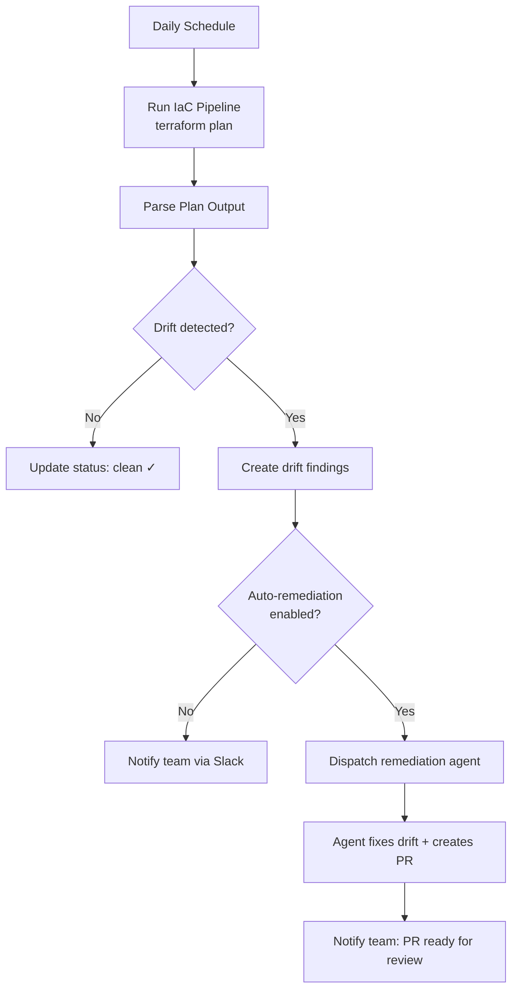

# Chapter 9: Scheduled & Autonomous Operations

> Cron-triggered scans, continuous drift detection, recurring compliance checks, and fully autonomous remediation loops.

---

## Beyond Chat: Agents That Run on Their Own

Most agent guides focus on interactive chat. But the highest-value infrastructure agent use cases are **fully autonomous** — agents that run on a schedule, detect problems, fix them, and report results without any human initiating the conversation.

```
┌─────────────────────────────────────────────────────────────┐
│                AUTONOMOUS AGENT LIFECYCLE                    │
│                                                             │
│   Schedule triggers    Agent detects     Agent remediates   │
│   ┌─────┐             ┌─────────┐       ┌──────────┐       │
│   │Cron │──→ Scan ──→ │ Finding │──→ ──→│ Fix + PR │       │
│   └─────┘             └─────────┘       └──────────┘       │
│       │                    │                  │             │
│       ▼                    ▼                  ▼             │
│   Next scheduled      Notification       Notification      │
│   run                 to team            to team            │
└─────────────────────────────────────────────────────────────┘
```

---

## Scheduling Approaches

### Option 1: Cron (Systemd / Kubernetes CronJob)

The simplest and most reliable approach.

```yaml
# Kubernetes CronJob — daily drift scan
apiVersion: batch/v1
kind: CronJob
metadata:
  name: daily-drift-scan
  namespace: agent-scheduler
spec:
  schedule: "0 6 * * *"  # Every day at 6:00 UTC
  concurrencyPolicy: Forbid  # Don't overlap
  jobTemplate:
    spec:
      template:
        spec:
          containers:
            - name: trigger
              image: curlimages/curl:latest
              command:
                - curl
                - -X POST
                - -H "Content-Type: application/json"
                - -H "Authorization: Bearer ${SCHEDULER_TOKEN}"
                - "http://api-server/api/v1/internal/scheduled-tasks/drift-scan"
                - -d '{"scope": "all-monitored-repos"}'
          restartPolicy: OnFailure
```

```typescript
// API endpoint: receive scheduled trigger
app.post('/api/v1/internal/scheduled-tasks/drift-scan', async (req, res) => {
  // Authenticate scheduler
  if (!isValidSchedulerToken(req.headers.authorization)) {
    return res.status(401).json({ error: 'Unauthorized' });
  }

  // Get all repositories with drift monitoring enabled
  const driftConfigs = await db.configDrift.findMany({
    where: {
      isActive: true,
      frequency: { not: 'UNMONITORED' },
      nextScanAt: { lte: new Date() },
    },
    include: { repository: true, pipeline: true },
  });

  // Dispatch scan tasks
  const tasks = await Promise.all(
    driftConfigs.map(config => dispatchDriftScan(config))
  );

  res.json({ dispatched: tasks.length });
});
```

### Option 2: AWS EventBridge (Serverless Scheduling)

```typescript
// CDK definition
import * as events from 'aws-cdk-lib/aws-events';
import * as targets from 'aws-cdk-lib/aws-events-targets';

// Daily compliance scan
new events.Rule(this, 'DailyComplianceScan', {
  schedule: events.Schedule.cron({ hour: '6', minute: '0' }),
  targets: [
    new targets.LambdaFunction(triggerLambda, {
      event: events.RuleTargetInput.fromObject({
        taskType: 'compliance-scan',
        scope: 'all-organizations',
      }),
    }),
  ],
});

// Hourly drift check
new events.Rule(this, 'HourlyDriftCheck', {
  schedule: events.Schedule.rate(Duration.hours(1)),
  targets: [
    new targets.LambdaFunction(triggerLambda, {
      event: events.RuleTargetInput.fromObject({
        taskType: 'drift-scan',
        scope: 'high-priority-repos',
      }),
    }),
  ],
});
```

### Option 3: Azure Timer Trigger (Functions)

```typescript
// Azure Function with timer trigger
import { app, Timer } from '@azure/functions';

app.timer('dailyDriftScan', {
  schedule: '0 0 6 * * *',  // Every day at 6:00 UTC
  handler: async (timer: Timer, context) => {
    context.log('Triggering daily drift scan');

    await fetch(`${API_URL}/api/v1/internal/scheduled-tasks/drift-scan`, {
      method: 'POST',
      headers: {
        'Authorization': `Bearer ${process.env.SCHEDULER_TOKEN}`,
        'Content-Type': 'application/json',
      },
      body: JSON.stringify({ scope: 'all-monitored-repos' }),
    });
  },
});
```

### Option 4: Temporal Schedules (Durable)

```typescript
import { Client } from '@temporalio/client';

const client = new Client();
const handle = await client.schedule.create({
  scheduleId: 'daily-drift-scan',
  spec: {
    calendars: [{ hour: 6, minute: 0 }],
  },
  action: {
    type: 'startWorkflow',
    workflowType: 'driftScanWorkflow',
    args: [{ scope: 'all-monitored-repos' }],
    taskQueue: 'agent-tasks',
  },
  policies: {
    overlap: 'SKIP',  // Don't overlap runs
    catchupWindow: '1h',  // Catch up missed runs within 1h
  },
});
```

### Option 5: In-Process Scheduler (Simple)

For simpler setups, run a scheduler within your API server:

```typescript
import Cron from 'croner';

// Drift scan — frequency varies per configuration
const driftScheduler = new Cron('*/15 * * * *', async () => {
  // Check every 15 min which configs are due for scanning
  const dueConfigs = await db.configDrift.findMany({
    where: {
      isActive: true,
      nextScanAt: { lte: new Date() },
    },
  });

  for (const config of dueConfigs) {
    await dispatchDriftScan(config);

    // Update next scan time based on frequency
    const nextScan = calculateNextScan(config.frequency);
    await db.configDrift.update({
      where: { id: config.id },
      data: { nextScanAt: nextScan },
    });
  }
});
```

---

## Scan Frequency Configuration

```typescript
enum ScanFrequency {
  UNMONITORED = 'UNMONITORED',  // No automatic scanning
  HOURLY = 'HOURLY',
  DAILY = 'DAILY',              // Default for most use cases
  WEEKLY = 'WEEKLY',
  MONTHLY = 'MONTHLY',
}

function calculateNextScan(frequency: ScanFrequency, from: Date = new Date()): Date {
  switch (frequency) {
    case 'HOURLY':  return addHours(from, 1);
    case 'DAILY':   return addDays(from, 1);
    case 'WEEKLY':  return addWeeks(from, 1);
    case 'MONTHLY': return addMonths(from, 1);
    default:        return null; // UNMONITORED
  }
}
```

---

## Autonomous Use Cases

### 1. Continuous Drift Detection



```typescript
async function handleDriftScanResult(result: DriftScanResult) {
  const driftConfig = await db.configDrift.findUnique({
    where: { id: result.configId },
  });

  if (result.driftResources.length === 0) {
    // Clean — update status
    await db.configDriftScan.update({
      where: { id: result.scanId },
      data: { status: 'CLEAN', completedAt: new Date() },
    });
    return;
  }

  // Drift detected — create findings
  for (const resource of result.driftResources) {
    await db.configDriftFinding.create({
      data: {
        configDriftId: driftConfig.id,
        resourceAddress: resource.address,
        providerResourceId: resource.resourceId,
        changeType: resource.changeType,
        status: 'OPEN',
      },
    });
  }

  // Auto-remediation if enabled
  if (driftConfig.autoCreatePR) {
    await dispatchRemediationAgent({
      type: 'drift-remediation',
      agentSlug: 'drift-remediation',
      context: {
        repositoryId: driftConfig.repositoryId,
        driftFindings: result.driftResources,
        pipelineId: driftConfig.pipelineId,
      },
    });
  }

  // Always notify
  await sendNotification({
    channel: driftConfig.notificationChannel,
    message: formatDriftNotification(driftConfig, result),
  });
}
```

### 2. Scheduled Compliance Scanning

```typescript
// Nightly: scan all cloud accounts for compliance findings
async function scheduledComplianceScan() {
  const integrations = await db.cloudIntegration.findMany({
    where: { complianceScanEnabled: true, deletedAt: null },
  });

  for (const integration of integrations) {
    // Dispatch Prowler/Checkov/custom scanner
    await dispatchTask({
      type: 'compliance-scan',
      payload: {
        integrationId: integration.id,
        frameworks: integration.enabledFrameworks, // ['CIS', 'SOC2', 'ISO27001']
        autoRemediate: integration.autoRemediateEnabled,
      },
    });
  }
}
```

### 3. Recurring Cost Optimization

```typescript
// Weekly: analyze cloud spending and suggest optimizations
async function scheduledCostAnalysis() {
  const organizations = await db.organization.findMany({
    where: { costOptimizationEnabled: true },
  });

  for (const org of organizations) {
    await dispatchTask({
      type: 'cost-analysis',
      payload: {
        organizationId: org.id,
        lookbackDays: 30,
        actions: ['identify-unused', 'rightsizing-recs', 'ri-coverage'],
        autoCreatePR: org.costAutoRemediate,
      },
    });
  }
}
```

### 4. Automated PR Review

```typescript
// Event-driven (not scheduled, but fully autonomous)
async function handlePRWebhook(event: PREvent) {
  // Auto-dispatch PR reviewer for IaC changes
  if (event.action === 'opened' || event.action === 'synchronize') {
    const repo = await db.repository.findUnique({
      where: { id: event.repositoryId },
    });

    if (repo.prReviewEnabled && hasIaCChanges(event.changedFiles)) {
      await dispatchTask({
        type: 'pr-review',
        agentSlug: 'pr-reviewer',
        payload: {
          pullRequestNumber: event.number,
          repositoryId: repo.id,
          baseBranch: event.baseBranch,
          headBranch: event.headBranch,
        },
      });
    }
  }
}
```

---

## Scheduling Comparison

| Approach | Reliability | Complexity | Catch-Up | Cost | Best For |
|----------|------------|-----------|----------|------|----------|
| **Kubernetes CronJob** | High | Low | Manual | Cluster | K8s-native |
| **AWS EventBridge** | Very High | Low | Built-in | Per-invocation | AWS-native |
| **Azure Timer Functions** | Very High | Low | Built-in | Per-invocation | Azure-native |
| **Temporal Schedules** | Very High | Medium | Built-in | Server cost | Complex workflows |
| **In-process (croner/cron)** | Medium | Lowest | Manual | Free | Simple setups |
| **pg_cron (PostgreSQL)** | High | Low | Manual | Free | DB-centric |

---

## Preventing Schedule Overload

When scanning hundreds of repositories, stagger dispatches to avoid queue flooding:

```typescript
async function staggeredDispatch(
  tasks: AgentTask[],
  intervalMs: number = 5000
): Promise<void> {
  for (let i = 0; i < tasks.length; i++) {
    await dispatchTask(tasks[i]);

    // Stagger to avoid queue/API overload
    if (i < tasks.length - 1) {
      await new Promise(resolve => setTimeout(resolve, intervalMs));
    }
  }
}
```

---

## Key Takeaways

1. **Scheduled operations are the highest-value use case** — continuous drift detection, compliance scanning, cost optimization
2. **Separate scheduling from execution** — scheduler triggers API, API dispatches to queue
3. **Match scheduling tech to your cloud** — EventBridge for AWS, Timer Functions for Azure, CronJobs for K8s
4. **Stagger dispatches** to avoid overwhelming queues and APIs
5. **Auto-remediation is opt-in** — always allow per-repo/per-org configuration
6. **Event-driven triggers** (webhooks) complement scheduled scans for real-time response

---

## Next Chapter

[Chapter 10: Notifications & Alerting →](./10-notifications.md)
