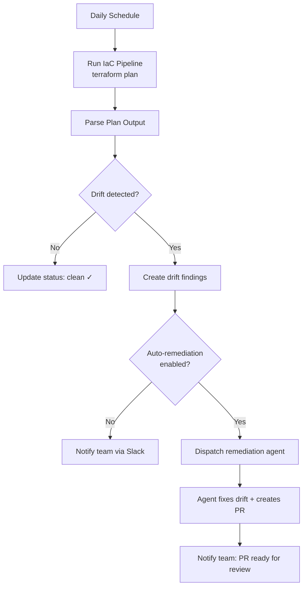
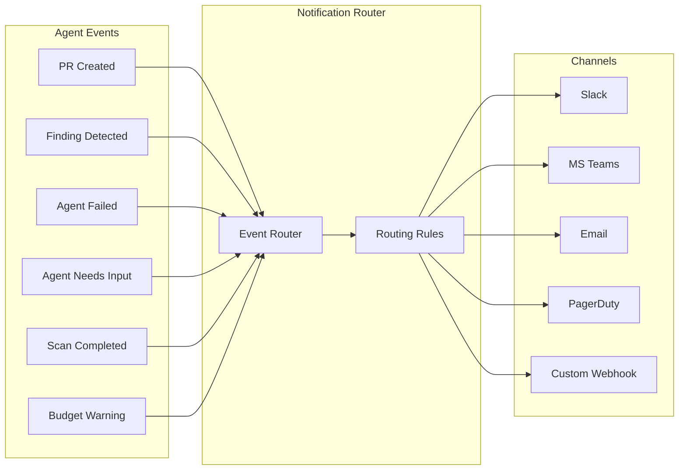

# Chapter 10: Autonomous Operations & Notifications

> Scheduling, autonomous use cases, notification routing, escalation chains, and daily digests.

---

## Beyond Chat: Agents That Run on Their Own

Interactive chat gets the demos. But the most consistent value comes from **fully autonomous** agents — running on a schedule, detecting problems, fixing them, and reporting results without any human initiating the conversation.

```
Schedule --> Scan --> Finding detected? --> Auto-remediate --> PR created
   |                       |                                     |
   v                       v                                     v
Next scheduled run    Notify team                           Notify team
```

---

## Scheduling

### Example: Kubernetes CronJob

The simplest and most reliable approach — a cron trigger that hits your API:

```yaml
# Kubernetes CronJob — daily drift scan
apiVersion: batch/v1
kind: CronJob
metadata:
  name: daily-drift-scan
  namespace: agent-scheduler
spec:
  schedule: "0 6 * * *"  # Every day at 6:00 UTC
  concurrencyPolicy: Forbid  # Don't overlap
  jobTemplate:
    spec:
      template:
        spec:
          containers:
            - name: trigger
              image: curlimages/curl:latest
              command:
                - curl
                - -X POST
                - -H "Content-Type: application/json"
                - -H "Authorization: Bearer ${SCHEDULER_TOKEN}"
                - "http://api-server/api/v1/internal/scheduled-tasks/drift-scan"
                - -d '{"scope": "all-monitored-repos"}'
          restartPolicy: OnFailure
```

The pattern is the same regardless of scheduler: an external trigger hits an authenticated API endpoint, which queries what needs scanning (based on configured frequency and last scan time) and dispatches tasks to the agent queue.

### Scheduling Comparison

| Approach | Reliability | Complexity | Catch-Up | Cost | Best For |
|----------|------------|-----------|----------|------|----------|
| **Kubernetes CronJob** | High | Low | Manual | Cluster | K8s-native |
| **AWS EventBridge** | Very High | Low | Built-in | Per-invocation | AWS-native |
| **Azure Timer Functions** | Very High | Low | Built-in | Per-invocation | Azure-native |
| **Temporal Schedules** | Very High | Medium | Built-in | Server cost | Complex workflows |
| **In-process (croner/cron)** | Medium | Lowest | Manual | Free | Simple setups |
| **pg_cron (PostgreSQL)** | High | Low | Manual | Free | DB-centric |

### Scan Frequency Options

Common frequencies for different use cases:

| Frequency | Use Case |
|-----------|----------|
| **Hourly** | High-value environments, incident response readiness |
| **Daily** | Default for most compliance and drift scanning |
| **Weekly** | Cost optimization, architecture reviews |
| **Monthly** | Low-change environments, audit reports |
| **Unmonitored** | Opt-out — no automatic scanning |

Track each configuration's last scan time and next scheduled scan to prevent duplicate dispatches and enable catch-up after outages.

### Preventing Schedule Overload

When scanning hundreds of repositories, stagger dispatches to avoid queue flooding:

```typescript
async function staggeredDispatch(
  tasks: AgentTask[],
  intervalMs: number = 5000
): Promise<void> {
  for (let i = 0; i < tasks.length; i++) {
    await dispatchTask(tasks[i]);

    if (i < tasks.length - 1) {
      await new Promise(resolve => setTimeout(resolve, intervalMs));
    }
  }
}
```

---

## Autonomous Use Cases

### 1. Continuous Drift Detection



The drift scan handler follows a simple decision tree:

1. **No drift** — mark the scan as clean, update last scan timestamp
2. **Drift detected** — create drift findings (resource address, change type, status)
3. **Auto-remediation enabled?** — dispatch a remediation agent to fix the drift and create a PR
4. **Always notify** — send a notification to the configured channel regardless of auto-remediation

```typescript
// Pseudocode: drift scan result handling
async function handleDriftScanResult(result: DriftScanResult) {
  if (result.driftResources.length === 0) {
    await markScanClean(result.scanId);
    return;
  }

  // Store drift findings for tracking
  await createDriftFindings(result.driftResources);

  // Auto-remediation if enabled for this repository
  if (result.config.autoRemediate) {
    await dispatchRemediationAgent({
      type: 'drift-remediation',
      repository: result.config.repository,
      driftFindings: result.driftResources,
    });
  }

  // Always notify
  await sendNotification(result.config.notificationChannel, {
    message: formatDriftNotification(result),
  });
}
```

### 2. Scheduled Compliance Scanning

Nightly: scan all connected cloud accounts for compliance findings. For each account with compliance scanning enabled, dispatch a task with the configured frameworks (CIS, SOC2, ISO 27001) and auto-remediation preference. Results feed into the data plane and trigger notifications.

### 3. Recurring Cost Optimization

Weekly: analyze cloud spending across accounts. Dispatch a cost analysis agent that identifies unused resources, rightsizing candidates, and reserved instance coverage gaps. If auto-remediation is enabled, the agent creates PRs to remove or resize resources.

### 4. Automated PR Review

Event-driven (not scheduled, but fully autonomous): when a PR is opened or updated, check if the repository has automated review enabled and the PR contains IaC changes. If so, dispatch a review agent that analyzes the changes, runs validation tools, and posts review comments.

```typescript
// Example: webhook handler for automated PR review
async function handlePRWebhook(event: PREvent) {
  if (event.action !== 'opened' && event.action !== 'synchronize') return;
  if (!isReviewEnabled(event.repositoryId)) return;
  if (!hasIaCChanges(event.changedFiles)) return;

  await dispatchTask({
    type: 'pr-review',
    payload: {
      pullRequestNumber: event.number,
      repositoryId: event.repositoryId,
      baseBranch: event.baseBranch,
      headBranch: event.headBranch,
    },
  });
}
```

---

## Notifications

Autonomous agents run in the background. Without notifications, you get two failure modes:

1. **Agent succeeds silently** — nobody reviews the PR, value is lost
2. **Agent fails silently** — problems compound until a human notices

### Notification Architecture



### Event Types and Severity

Categorize notification events by urgency so routing rules can direct them appropriately:

| Severity | Meaning | Examples |
|----------|---------|---------|
| **Info** | Agent completed work, scan finished clean | Drift remediated, scan clean |
| **Warning** | Budget threshold, partial failure, findings detected | Drift detected, budget exceeded |
| **Action** | Human action needed — PR review, approval | PR created, agent needs input |
| **Urgent** | Critical failure, critical security finding | Agent failed, critical finding |

Map each event type to a default severity:

| Event | Default Severity |
|-------|-----------------|
| `pr.created` | Action |
| `scan.completed.clean` | Info |
| `scan.completed.findings` | Warning |
| `drift.detected` | Warning |
| `drift.auto_remediated` | Info |
| `agent.failed` | Urgent |
| `agent.needs_input` | Action |
| `agent.budget_exceeded` | Warning |
| `finding.critical` | Urgent |

Each notification event should carry: type, severity, title, body, metadata (organization, agent, repository, PR URL if applicable), and an optional deduplication key to prevent duplicate notifications for the same event.

### Channel Implementations

Each channel follows the same pattern: receive a notification event, format it for the platform, POST it. Key considerations per channel:

| Channel | API / Protocol | Key Detail |
|---------|---------------|------------|
| **Microsoft Teams** | Adaptive Cards via webhook | Use `AdaptiveCard` v1.4 with `FactSet` for metadata and `Action.OpenUrl` for PR links |
| **Email** (SendGrid/SES) | SMTP or REST API | Subject line: `[SEVERITY] title`. Use HTML template with plain-text fallback |
| **PagerDuty** | Events API v2 (`/v2/enqueue`) | Only trigger for `urgent` events. Set `routing_key`, `severity: 'critical'`, source as agent slug |
| **Generic Webhook** | HTTP POST | Pass `X-Event-Type` and `X-Severity` headers. Body is the full `NotificationEvent` JSON |

---

## Notification Routing Rules

Routing rules determine which events go to which channels. Each rule specifies:

- **Filter** — which event types, severities, agents, or repositories to match
- **Channel** — where to send (Slack, Teams, email, PagerDuty, webhook)
- **Deduplication window** — prevent duplicate notifications for the same event within a time window

The routing logic: for each notification event, evaluate all active rules for the organization. If the event matches a rule's filter and isn't deduplicated, send it to the configured channel.

This gives teams fine-grained control: "send all `urgent` events to PagerDuty, all `pr.created` events to #infra-prs in Slack, and daily digests to email."

---

## Daily Digests

Instead of individual notifications for every event, send periodic summaries. A daily digest should include:

- **Agent sessions**: total, completed, failed
- **PRs created**: count with links to the most important ones
- **Token usage**: total tokens consumed (for cost tracking)
- **Open findings**: new findings detected, findings auto-remediated
- **Failures**: any agent failures with brief context

Set the digest severity based on content: `warning` if there are failures, `info` if everything is clean. Route digests through the same notification system so teams can choose their preferred channel.

---

## Escalation Chains

For critical failures, escalate through channels with increasing urgency:

```
Minute 0:  Slack notification to #infra-agents channel
Minute 5:  Slack DM to on-call engineer
Minute 15: PagerDuty incident (if unacknowledged)
Minute 30: PagerDuty escalation to team lead
```

```typescript
async function escalate(event: NotificationEvent, level: number = 0) {
  const chain = [
    { channel: 'slack', config: { channel: '#infra-agents' }, delayMs: 0 },
    { channel: 'slack', config: { mentionUsers: ['U_ONCALL'] }, delayMs: 5 * 60_000 },
    { channel: 'pagerduty', config: { routingKey: PD_KEY }, delayMs: 15 * 60_000 },
  ];

  if (level >= chain.length) return;

  const step = chain[level];
  await sendToChannel(step, event);

  if (level + 1 < chain.length) {
    setTimeout(async () => {
      const acknowledged = await isEventAcknowledged(event.dedupeKey);
      if (!acknowledged) {
        await escalate(event, level + 1);
      }
    }, chain[level + 1].delayMs - step.delayMs);
  }
}
```

---

## Next Chapter

[Chapter 11: Testing & Hardening →](./11-testing-hardening.md)

---

*Built by the team at [Cloudgeni](https://cloudgeni.ai) — Scale your infrastructure team. With Agents. Safely.*
