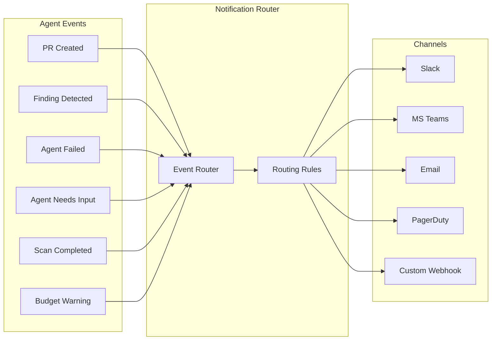

# Chapter 10: Notifications & Alerting

> Keeping humans informed about what agents are doing, and escalating when they need help.

---

## Why Notifications Matter

Autonomous agents run in the background. Without a notification system, you have two failure modes:

1. **Agent succeeds silently** — nobody reviews the PR, value is lost
2. **Agent fails silently** — problems compound until a human notices

A good notification system makes agent work **visible** and **actionable**.

---

## Notification Architecture



---

## Event Types and Severity

```typescript
enum NotificationSeverity {
  INFO = 'info',         // Agent completed work, scan finished
  WARNING = 'warning',   // Budget threshold, partial failure
  ACTION = 'action',     // PR ready for review, approval needed
  URGENT = 'urgent',     // Agent failed, critical finding
}

interface NotificationEvent {
  type: string;
  severity: NotificationSeverity;
  title: string;
  body: string;
  metadata: {
    organizationId: string;
    agentSlug?: string;
    sessionId?: string;
    repositoryName?: string;
    prUrl?: string;
    findingId?: string;
  };
  channels: string[];     // Where to send
  dedupeKey?: string;     // Prevent duplicate notifications
}

// Event type → severity mapping
const EVENT_SEVERITY: Record<string, NotificationSeverity> = {
  'pr.created': 'action',
  'pr.review_requested': 'action',
  'scan.completed.clean': 'info',
  'scan.completed.findings': 'warning',
  'drift.detected': 'warning',
  'drift.auto_remediated': 'info',
  'agent.failed': 'urgent',
  'agent.needs_input': 'action',
  'agent.budget_exceeded': 'warning',
  'finding.critical': 'urgent',
};
```

---

## Channel Implementations

### Slack (Webhook + Block Kit)

```typescript
interface SlackNotificationConfig {
  webhookUrl: string;
  channel?: string;        // Override default channel
  mentionUsers?: string[]; // @user for urgent
  mentionGroups?: string[]; // @team for escalation
}

async function sendSlackNotification(
  config: SlackNotificationConfig,
  event: NotificationEvent
) {
  const colorMap = {
    info: '#36a64f',
    warning: '#ff9500',
    action: '#2196F3',
    urgent: '#ff0000',
  };

  const blocks = [
    {
      type: 'header',
      text: { type: 'plain_text', text: event.title },
    },
    {
      type: 'section',
      text: { type: 'mrkdwn', text: event.body },
    },
  ];

  // Add action buttons for actionable events
  if (event.metadata.prUrl) {
    blocks.push({
      type: 'actions',
      elements: [{
        type: 'button',
        text: { type: 'plain_text', text: 'Review PR' },
        url: event.metadata.prUrl,
        style: 'primary',
      }],
    });
  }

  // Mention users for urgent events
  let text = '';
  if (event.severity === 'urgent' && config.mentionGroups?.length) {
    text = config.mentionGroups.map(g => `<!subteam^${g}>`).join(' ');
  }

  await fetch(config.webhookUrl, {
    method: 'POST',
    headers: { 'Content-Type': 'application/json' },
    body: JSON.stringify({
      channel: config.channel,
      text,
      attachments: [{
        color: colorMap[event.severity],
        blocks,
      }],
    }),
  });
}
```

### Microsoft Teams (Adaptive Cards)

```typescript
async function sendTeamsNotification(
  webhookUrl: string,
  event: NotificationEvent
) {
  const card = {
    type: 'message',
    attachments: [{
      contentType: 'application/vnd.microsoft.card.adaptive',
      content: {
        $schema: 'http://adaptivecards.io/schemas/adaptive-card.json',
        type: 'AdaptiveCard',
        version: '1.4',
        body: [
          {
            type: 'TextBlock',
            text: event.title,
            weight: 'Bolder',
            size: 'Large',
          },
          {
            type: 'TextBlock',
            text: event.body,
            wrap: true,
          },
          {
            type: 'FactSet',
            facts: [
              { title: 'Agent', value: event.metadata.agentSlug || 'N/A' },
              { title: 'Repository', value: event.metadata.repositoryName || 'N/A' },
              { title: 'Severity', value: event.severity },
            ],
          },
        ],
        actions: event.metadata.prUrl ? [{
          type: 'Action.OpenUrl',
          title: 'Review PR',
          url: event.metadata.prUrl,
        }] : [],
      },
    }],
  };

  await fetch(webhookUrl, {
    method: 'POST',
    headers: { 'Content-Type': 'application/json' },
    body: JSON.stringify(card),
  });
}
```

### Email (via SendGrid / SES / SMTP)

```typescript
async function sendEmailNotification(
  recipients: string[],
  event: NotificationEvent
) {
  await sendgrid.send({
    to: recipients,
    from: 'agents@your-platform.com',
    subject: `[${event.severity.toUpperCase()}] ${event.title}`,
    html: renderEmailTemplate(event),
  });
}
```

### PagerDuty (Incident Escalation)

```typescript
async function sendPagerDutyAlert(
  routingKey: string,
  event: NotificationEvent
) {
  // Only escalate urgent events
  if (event.severity !== 'urgent') return;

  await fetch('https://events.pagerduty.com/v2/enqueue', {
    method: 'POST',
    headers: { 'Content-Type': 'application/json' },
    body: JSON.stringify({
      routing_key: routingKey,
      event_action: 'trigger',
      payload: {
        summary: event.title,
        severity: 'critical',
        source: `agent:${event.metadata.agentSlug}`,
        custom_details: {
          body: event.body,
          sessionId: event.metadata.sessionId,
          repository: event.metadata.repositoryName,
        },
      },
    }),
  });
}
```

### Generic Webhook

```typescript
async function sendWebhookNotification(
  url: string,
  event: NotificationEvent
) {
  await fetch(url, {
    method: 'POST',
    headers: {
      'Content-Type': 'application/json',
      'X-Event-Type': event.type,
      'X-Severity': event.severity,
    },
    body: JSON.stringify(event),
  });
}
```

---

## Notification Routing Rules

```typescript
interface NotificationRule {
  id: string;
  organizationId: string;
  name: string;
  // What triggers this rule
  filter: {
    eventTypes?: string[];           // ['pr.created', 'drift.detected']
    severities?: NotificationSeverity[];
    agentSlugs?: string[];
    repositories?: string[];
  };
  // Where to send
  channel: {
    type: 'slack' | 'teams' | 'email' | 'pagerduty' | 'webhook';
    config: Record<string, unknown>; // Channel-specific config
  };
  // Controls
  dedupeWindowMs?: number;           // Don't resend same event within window
  enabled: boolean;
}

// Route an event through matching rules
async function routeNotification(event: NotificationEvent) {
  const rules = await db.notificationRule.findMany({
    where: { organizationId: event.metadata.organizationId, enabled: true },
  });

  for (const rule of rules) {
    if (!matchesFilter(event, rule.filter)) continue;

    // Deduplicate
    if (rule.dedupeWindowMs && event.dedupeKey) {
      const cacheKey = `notif:${rule.id}:${event.dedupeKey}`;
      const exists = await redis.get(cacheKey);
      if (exists) continue;
      await redis.set(cacheKey, '1', 'PX', rule.dedupeWindowMs);
    }

    // Send via appropriate channel
    await sendToChannel(rule.channel, event);
  }
}
```

---

## Summary Digests

Instead of individual notifications for every event, send periodic summaries:

```typescript
// Daily digest: summarize all agent activity
async function sendDailyDigest(organizationId: string) {
  const since = subDays(new Date(), 1);

  const stats = await db.$queryRaw`
    SELECT
      COUNT(*) FILTER (WHERE status = 'COMPLETED') as completed,
      COUNT(*) FILTER (WHERE status = 'FAILED') as failed,
      COUNT(DISTINCT "sessionId") as sessions,
      SUM("inputTokens" + "outputTokens") as total_tokens
    FROM agent_session_runs
    WHERE "organizationId" = ${organizationId}
      AND "createdAt" >= ${since}
  `;

  const prsCreated = await db.pullRequest.count({
    where: { organizationId, createdAt: { gte: since } },
  });

  const digest = {
    title: `Daily Agent Summary — ${format(new Date(), 'MMM d, yyyy')}`,
    body: [
      `**${stats.sessions}** agent sessions | **${stats.completed}** completed | **${stats.failed}** failed`,
      `**${prsCreated}** PRs created | **${stats.total_tokens?.toLocaleString()}** tokens used`,
    ].join('\n'),
    severity: stats.failed > 0 ? 'warning' : 'info',
  };

  await routeNotification(digest);
}
```

---

## Escalation Chains

For critical failures, escalate through channels with increasing urgency:

```
Minute 0:  Slack notification to #infra-agents channel
Minute 5:  Slack DM to on-call engineer
Minute 15: PagerDuty incident (if unacknowledged)
Minute 30: PagerDuty escalation to team lead
```

```typescript
async function escalate(event: NotificationEvent, level: number = 0) {
  const chain = [
    { channel: 'slack', config: { channel: '#infra-agents' }, delayMs: 0 },
    { channel: 'slack', config: { mentionUsers: ['U_ONCALL'] }, delayMs: 5 * 60_000 },
    { channel: 'pagerduty', config: { routingKey: PD_KEY }, delayMs: 15 * 60_000 },
  ];

  if (level >= chain.length) return;

  const step = chain[level];
  await sendToChannel(step, event);

  // Schedule next escalation (if not acknowledged)
  if (level + 1 < chain.length) {
    setTimeout(async () => {
      const acknowledged = await isEventAcknowledged(event.dedupeKey);
      if (!acknowledged) {
        await escalate(event, level + 1);
      }
    }, chain[level + 1].delayMs - step.delayMs);
  }
}
```

---

## Key Takeaways

1. **Route by severity** — info to Slack, urgent to PagerDuty
2. **Actionable notifications** — include PR links, finding details, direct action buttons
3. **Deduplicate** — don't flood channels with repeated events
4. **Daily digests** complement individual notifications
5. **Escalation chains** ensure critical failures don't go unnoticed
6. **Custom webhooks** enable integration with any system

---

## Next Chapter

[Chapter 11: Session & State Management →](./11-session-state.md)
