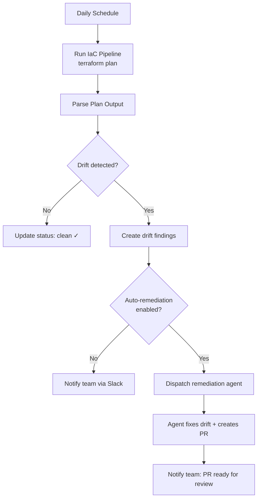
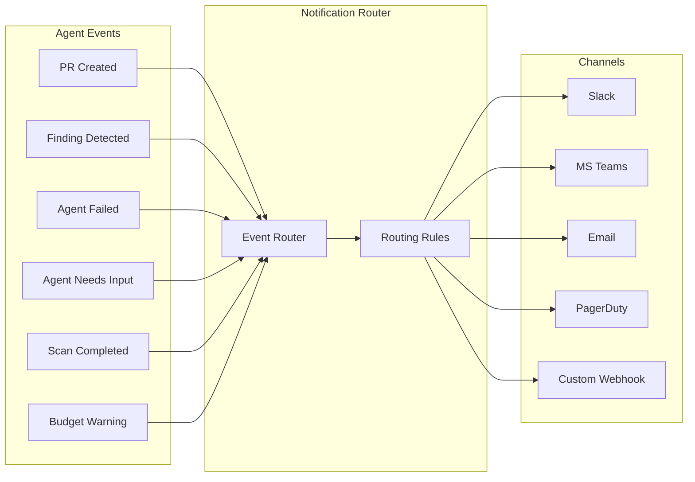

# Chapter 10: Autonomous Operations & Notifications

> Scheduling, autonomous use cases, notification routing, escalation chains, and daily digests.

---

## Beyond Chat: Agents That Run on Their Own

Interactive chat gets the demos. But the most consistent value comes from **fully autonomous** agents — running on a schedule, detecting problems, fixing them, and reporting results without any human initiating the conversation.

```
┌─────────────────────────────────────────────────────────────┐
│                AUTONOMOUS AGENT LIFECYCLE                    │
│                                                             │
│   Schedule triggers    Agent detects     Agent remediates   │
│   ┌─────┐             ┌─────────┐       ┌──────────┐       │
│   │Cron │──→ Scan ──→ │ Finding │──→ ──→│ Fix + PR │       │
│   └─────┘             └─────────┘       └──────────┘       │
│       │                    │                  │             │
│       ▼                    ▼                  ▼             │
│   Next scheduled      Notification       Notification      │
│   run                 to team            to team            │
└─────────────────────────────────────────────────────────────┘
```

---

## Scheduling

### Example: Kubernetes CronJob

The simplest and most reliable approach — a cron trigger that hits your API:

```yaml
# Kubernetes CronJob — daily drift scan
apiVersion: batch/v1
kind: CronJob
metadata:
  name: daily-drift-scan
  namespace: agent-scheduler
spec:
  schedule: "0 6 * * *"  # Every day at 6:00 UTC
  concurrencyPolicy: Forbid  # Don't overlap
  jobTemplate:
    spec:
      template:
        spec:
          containers:
            - name: trigger
              image: curlimages/curl:latest
              command:
                - curl
                - -X POST
                - -H "Content-Type: application/json"
                - -H "Authorization: Bearer ${SCHEDULER_TOKEN}"
                - "http://api-server/api/v1/internal/scheduled-tasks/drift-scan"
                - -d '{"scope": "all-monitored-repos"}'
          restartPolicy: OnFailure
```

```typescript
// API endpoint: receive scheduled trigger
app.post('/api/v1/internal/scheduled-tasks/drift-scan', async (req, res) => {
  if (!isValidSchedulerToken(req.headers.authorization)) {
    return res.status(401).json({ error: 'Unauthorized' });
  }

  const driftConfigs = await db.configDrift.findMany({
    where: {
      isActive: true,
      frequency: { not: 'UNMONITORED' },
      nextScanAt: { lte: new Date() },
    },
    include: { repository: true, pipeline: true },
  });

  const tasks = await Promise.all(
    driftConfigs.map(config => dispatchDriftScan(config))
  );

  res.json({ dispatched: tasks.length });
});
```

The pattern is the same regardless of scheduler: an external trigger hits an authenticated API endpoint, which queries what needs scanning and dispatches tasks.

### Scheduling Comparison

| Approach | Reliability | Complexity | Catch-Up | Cost | Best For |
|----------|------------|-----------|----------|------|----------|
| **Kubernetes CronJob** | High | Low | Manual | Cluster | K8s-native |
| **AWS EventBridge** | Very High | Low | Built-in | Per-invocation | AWS-native |
| **Azure Timer Functions** | Very High | Low | Built-in | Per-invocation | Azure-native |
| **Temporal Schedules** | Very High | Medium | Built-in | Server cost | Complex workflows |
| **In-process (croner/cron)** | Medium | Lowest | Manual | Free | Simple setups |
| **pg_cron (PostgreSQL)** | High | Low | Manual | Free | DB-centric |

### Scan Frequency Configuration

```typescript
enum ScanFrequency {
  UNMONITORED = 'UNMONITORED',  // No automatic scanning
  HOURLY = 'HOURLY',
  DAILY = 'DAILY',              // Default for most use cases
  WEEKLY = 'WEEKLY',
  MONTHLY = 'MONTHLY',
}

function calculateNextScan(frequency: ScanFrequency, from: Date = new Date()): Date {
  switch (frequency) {
    case 'HOURLY':  return addHours(from, 1);
    case 'DAILY':   return addDays(from, 1);
    case 'WEEKLY':  return addWeeks(from, 1);
    case 'MONTHLY': return addMonths(from, 1);
    default:        return null; // UNMONITORED
  }
}
```

### Preventing Schedule Overload

When scanning hundreds of repositories, stagger dispatches to avoid queue flooding:

```typescript
async function staggeredDispatch(
  tasks: AgentTask[],
  intervalMs: number = 5000
): Promise<void> {
  for (let i = 0; i < tasks.length; i++) {
    await dispatchTask(tasks[i]);

    if (i < tasks.length - 1) {
      await new Promise(resolve => setTimeout(resolve, intervalMs));
    }
  }
}
```

---

## Autonomous Use Cases

### 1. Continuous Drift Detection



```typescript
async function handleDriftScanResult(result: DriftScanResult) {
  const driftConfig = await db.configDrift.findUnique({
    where: { id: result.configId },
  });

  if (result.driftResources.length === 0) {
    await db.configDriftScan.update({
      where: { id: result.scanId },
      data: { status: 'CLEAN', completedAt: new Date() },
    });
    return;
  }

  // Drift detected — create findings
  for (const resource of result.driftResources) {
    await db.configDriftFinding.create({
      data: {
        configDriftId: driftConfig.id,
        resourceAddress: resource.address,
        providerResourceId: resource.resourceId,
        changeType: resource.changeType,
        status: 'OPEN',
      },
    });
  }

  // Auto-remediation if enabled
  if (driftConfig.autoCreatePR) {
    await dispatchRemediationAgent({
      type: 'drift-remediation',
      agentSlug: 'drift-remediation',
      context: {
        repositoryId: driftConfig.repositoryId,
        driftFindings: result.driftResources,
        pipelineId: driftConfig.pipelineId,
      },
    });
  }

  // Always notify
  await sendNotification({
    channel: driftConfig.notificationChannel,
    message: formatDriftNotification(driftConfig, result),
  });
}
```

### 2. Scheduled Compliance Scanning

```typescript
// Nightly: scan all cloud accounts for compliance findings
async function scheduledComplianceScan() {
  const integrations = await db.cloudIntegration.findMany({
    where: { complianceScanEnabled: true, deletedAt: null },
  });

  for (const integration of integrations) {
    await dispatchTask({
      type: 'compliance-scan',
      payload: {
        integrationId: integration.id,
        frameworks: integration.enabledFrameworks, // ['CIS', 'SOC2', 'ISO27001']
        autoRemediate: integration.autoRemediateEnabled,
      },
    });
  }
}
```

### 3. Recurring Cost Optimization

```typescript
// Weekly: analyze cloud spending and suggest optimizations
async function scheduledCostAnalysis() {
  const organizations = await db.organization.findMany({
    where: { costOptimizationEnabled: true },
  });

  for (const org of organizations) {
    await dispatchTask({
      type: 'cost-analysis',
      payload: {
        organizationId: org.id,
        lookbackDays: 30,
        actions: ['identify-unused', 'rightsizing-recs', 'ri-coverage'],
        autoCreatePR: org.costAutoRemediate,
      },
    });
  }
}
```

### 4. Automated PR Review

```typescript
// Event-driven (not scheduled, but fully autonomous)
async function handlePRWebhook(event: PREvent) {
  if (event.action === 'opened' || event.action === 'synchronize') {
    const repo = await db.repository.findUnique({
      where: { id: event.repositoryId },
    });

    if (repo.prReviewEnabled && hasIaCChanges(event.changedFiles)) {
      await dispatchTask({
        type: 'pr-review',
        agentSlug: 'pr-reviewer',
        payload: {
          pullRequestNumber: event.number,
          repositoryId: repo.id,
          baseBranch: event.baseBranch,
          headBranch: event.headBranch,
        },
      });
    }
  }
}
```

---

## Notifications

Autonomous agents run in the background. Without notifications, you get two failure modes:

1. **Agent succeeds silently** — nobody reviews the PR, value is lost
2. **Agent fails silently** — problems compound until a human notices

### Notification Architecture



### Event Types and Severity

```typescript
enum NotificationSeverity {
  INFO = 'info',         // Agent completed work, scan finished
  WARNING = 'warning',   // Budget threshold, partial failure
  ACTION = 'action',     // PR ready for review, approval needed
  URGENT = 'urgent',     // Agent failed, critical finding
}

interface NotificationEvent {
  type: string;
  severity: NotificationSeverity;
  title: string;
  body: string;
  metadata: {
    organizationId: string;
    agentSlug?: string;
    sessionId?: string;
    repositoryName?: string;
    prUrl?: string;
    findingId?: string;
  };
  channels: string[];     // Where to send
  dedupeKey?: string;     // Prevent duplicate notifications
}

const EVENT_SEVERITY: Record<string, NotificationSeverity> = {
  'pr.created': 'action',
  'pr.review_requested': 'action',
  'scan.completed.clean': 'info',
  'scan.completed.findings': 'warning',
  'drift.detected': 'warning',
  'drift.auto_remediated': 'info',
  'agent.failed': 'urgent',
  'agent.needs_input': 'action',
  'agent.budget_exceeded': 'warning',
  'finding.critical': 'urgent',
};
```

### Channel: Slack (Webhook + Block Kit)

Full implementation — other channels follow the same pattern:

```typescript
interface SlackNotificationConfig {
  webhookUrl: string;
  channel?: string;
  mentionUsers?: string[];
  mentionGroups?: string[];
}

async function sendSlackNotification(
  config: SlackNotificationConfig,
  event: NotificationEvent
) {
  const colorMap = {
    info: '#36a64f',
    warning: '#ff9500',
    action: '#2196F3',
    urgent: '#ff0000',
  };

  const blocks = [
    {
      type: 'header',
      text: { type: 'plain_text', text: event.title },
    },
    {
      type: 'section',
      text: { type: 'mrkdwn', text: event.body },
    },
  ];

  if (event.metadata.prUrl) {
    blocks.push({
      type: 'actions',
      elements: [{
        type: 'button',
        text: { type: 'plain_text', text: 'Review PR' },
        url: event.metadata.prUrl,
        style: 'primary',
      }],
    });
  }

  let text = '';
  if (event.severity === 'urgent' && config.mentionGroups?.length) {
    text = config.mentionGroups.map(g => `<!subteam^${g}>`).join(' ');
  }

  await fetch(config.webhookUrl, {
    method: 'POST',
    headers: { 'Content-Type': 'application/json' },
    body: JSON.stringify({
      channel: config.channel,
      text,
      attachments: [{
        color: colorMap[event.severity],
        blocks,
      }],
    }),
  });
}
```

### Other Channels

Each channel follows the same pattern: receive a `NotificationEvent`, format it for the platform, POST it.

| Channel | API / Protocol | Key Detail |
|---------|---------------|------------|
| **Microsoft Teams** | Adaptive Cards via webhook | Use `AdaptiveCard` v1.4 with `FactSet` for metadata and `Action.OpenUrl` for PR links |
| **Email** (SendGrid/SES) | SMTP or REST API | Subject line: `[SEVERITY] title`. Use HTML template with plain-text fallback |
| **PagerDuty** | Events API v2 (`/v2/enqueue`) | Only trigger for `urgent` events. Set `routing_key`, `severity: 'critical'`, source as agent slug |
| **Generic Webhook** | HTTP POST | Pass `X-Event-Type` and `X-Severity` headers. Body is the full `NotificationEvent` JSON |

---

## Notification Routing Rules

```typescript
interface NotificationRule {
  id: string;
  organizationId: string;
  name: string;
  filter: {
    eventTypes?: string[];           // ['pr.created', 'drift.detected']
    severities?: NotificationSeverity[];
    agentSlugs?: string[];
    repositories?: string[];
  };
  channel: {
    type: 'slack' | 'teams' | 'email' | 'pagerduty' | 'webhook';
    config: Record<string, unknown>;
  };
  dedupeWindowMs?: number;
  enabled: boolean;
}

async function routeNotification(event: NotificationEvent) {
  const rules = await db.notificationRule.findMany({
    where: { organizationId: event.metadata.organizationId, enabled: true },
  });

  for (const rule of rules) {
    if (!matchesFilter(event, rule.filter)) continue;

    // Deduplicate
    if (rule.dedupeWindowMs && event.dedupeKey) {
      const cacheKey = `notif:${rule.id}:${event.dedupeKey}`;
      const exists = await redis.get(cacheKey);
      if (exists) continue;
      await redis.set(cacheKey, '1', 'PX', rule.dedupeWindowMs);
    }

    await sendToChannel(rule.channel, event);
  }
}
```

---

## Daily Digests

Instead of individual notifications for every event, send periodic summaries:

```typescript
async function sendDailyDigest(organizationId: string) {
  const since = subDays(new Date(), 1);

  const stats = await db.$queryRaw`
    SELECT
      COUNT(*) FILTER (WHERE status = 'COMPLETED') as completed,
      COUNT(*) FILTER (WHERE status = 'FAILED') as failed,
      COUNT(DISTINCT "sessionId") as sessions,
      SUM("inputTokens" + "outputTokens") as total_tokens
    FROM agent_session_runs
    WHERE "organizationId" = ${organizationId}
      AND "createdAt" >= ${since}
  `;

  const prsCreated = await db.pullRequest.count({
    where: { organizationId, createdAt: { gte: since } },
  });

  const digest = {
    title: `Daily Agent Summary — ${format(new Date(), 'MMM d, yyyy')}`,
    body: [
      `**${stats.sessions}** agent sessions | **${stats.completed}** completed | **${stats.failed}** failed`,
      `**${prsCreated}** PRs created | **${stats.total_tokens?.toLocaleString()}** tokens used`,
    ].join('\n'),
    severity: stats.failed > 0 ? 'warning' : 'info',
  };

  await routeNotification(digest);
}
```

---

## Escalation Chains

For critical failures, escalate through channels with increasing urgency:

```
Minute 0:  Slack notification to #infra-agents channel
Minute 5:  Slack DM to on-call engineer
Minute 15: PagerDuty incident (if unacknowledged)
Minute 30: PagerDuty escalation to team lead
```

```typescript
async function escalate(event: NotificationEvent, level: number = 0) {
  const chain = [
    { channel: 'slack', config: { channel: '#infra-agents' }, delayMs: 0 },
    { channel: 'slack', config: { mentionUsers: ['U_ONCALL'] }, delayMs: 5 * 60_000 },
    { channel: 'pagerduty', config: { routingKey: PD_KEY }, delayMs: 15 * 60_000 },
  ];

  if (level >= chain.length) return;

  const step = chain[level];
  await sendToChannel(step, event);

  if (level + 1 < chain.length) {
    setTimeout(async () => {
      const acknowledged = await isEventAcknowledged(event.dedupeKey);
      if (!acknowledged) {
        await escalate(event, level + 1);
      }
    }, chain[level + 1].delayMs - step.delayMs);
  }
}
```

---

## Next Chapter

[Chapter 11: Testing & Hardening →](./11-testing-hardening.md)

---

*Built by the team at [Cloudgeni](https://cloudgeni.ai) — Scale your infrastructure team. With Agents. Safely.*
