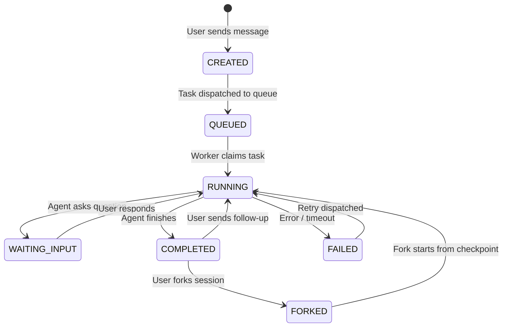
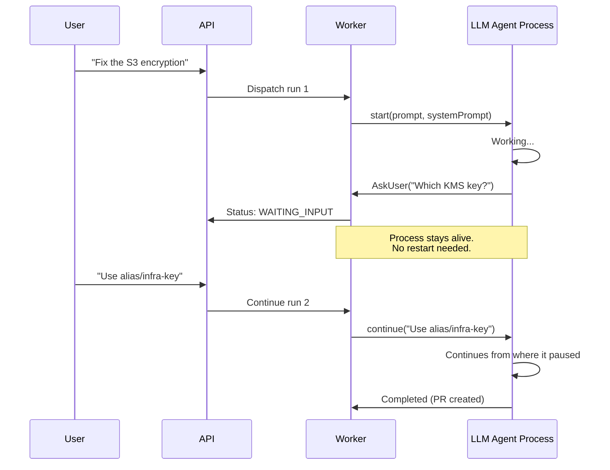

# Chapter 11: Session & State Management

> Multi-turn conversations, persistence across restarts, and session forking.

---

## Why Sessions Are Hard

Infrastructure agent sessions aren't like chat sessions. They can:

- **Last hours or days** — waiting for human PR review, pipeline completion
- **Span multiple worker instances** — workers crash, scale, rotate
- **Fork** — user wants to try a different approach from a conversation midpoint
- **Resume** — user returns with follow-up questions days later

You need a state management system that handles all of this.

---

## Session Lifecycle



---

## Session Data Model

```typescript
interface AgentSession {
  id: string;
  organizationId: string;
  agentSlug: string;
  status: 'active' | 'completed' | 'failed' | 'archived';

  // Fork chain
  parentSessionId?: string;       // If forked from another session
  forkedFromMessageId?: string;   // Specific message to fork from

  // Context
  repositoryId?: string;
  triggerSource: 'user' | 'webhook' | 'schedule' | 'api';

  // Runs (one per user message / scheduled continuation)
  runs: AgentSessionRun[];
}

interface AgentSessionRun {
  id: string;
  sessionId: string;
  status: 'QUEUED' | 'RUNNING' | 'WAITING_INPUT' | 'COMPLETED' | 'FAILED';
  prompt: string;               // User message that triggered this run

  // Metrics
  inputTokens: number;
  outputTokens: number;
  toolCalls: number;
  startedAt?: Date;
  completedAt?: Date;

  // Messages
  messages: AgentMessage[];
}

interface AgentMessage {
  id: string;
  runId: string;
  role: 'user' | 'assistant' | 'tool';
  content: string;
  toolName?: string;
  toolArgs?: Record<string, unknown>;
  timestamp: Date;
}
```

---

## Persistent Agent Process

The key optimization: **keep the LLM agent process alive between turns** instead of restarting for every message.



```typescript
class PersistentAgentRunner {
  private process: AsyncGenerator | null = null;
  private isWaiting = false;

  async start(prompt: string, systemPrompt: string): Promise<RunResult> {
    // Start the agent process (e.g., Claude Code SDK query())
    this.process = agentSDK.query({
      prompt,
      systemPrompt,
      tools: this.tools,
    });

    return this.consumeUntilPause();
  }

  async continue(userMessage: string): Promise<RunResult> {
    if (!this.process) throw new Error('No active process');
    if (!this.isWaiting) throw new Error('Agent not waiting for input');

    // Feed the user message into the waiting generator
    this.process.next(userMessage);
    return this.consumeUntilPause();
  }

  private async consumeUntilPause(): Promise<RunResult> {
    for await (const event of this.process) {
      if (event.type === 'ask_user') {
        this.isWaiting = true;
        return { status: 'waiting_input', question: event.question };
      }
      if (event.type === 'complete') {
        return { status: 'completed', result: event.result };
      }
      // Emit other events (tool calls, messages) to output stream
      await this.emitEvent(event);
    }
  }

  async stop(): Promise<void> {
    this.process?.return(undefined);
    this.process = null;
  }
}
```

---

## Session Persistence: Surviving Worker Restarts

When a worker crashes or the session needs to move to a different worker, you need to persist and restore the full session state.

### What to Persist

```
Session State
├── Conversation history (messages + tool results)
├── Git working directory (all file changes)
├── Agent process state (Claude session files)
└── Metadata (iteration count, budget usage, etc.)
```

### Storage Options

| Storage | Good For | Latency | Cost |
|---------|----------|---------|------|
| **Azure Blob Storage** | Large files (git bundles, session files) | ~50ms | Cheap |
| **AWS S3** | Same as above | ~50ms | Cheap |
| **Redis** | Small state, fast access | ~1ms | Medium |
| **PostgreSQL** | Structured data, queries | ~5ms | Medium |

### Git Bundle Pattern

Instead of persisting the full git repository, create a git bundle (compressed binary diff):

```typescript
async function persistGitState(
  workDir: string,
  sessionId: string,
  storage: BlobStorage
): Promise<string> {
  // Create a git bundle of all branches
  const bundlePath = path.join(os.tmpdir(), `${sessionId}.bundle`);
  await exec(`git bundle create ${bundlePath} --all`, { cwd: workDir });

  // Upload to blob storage
  const blobPath = `sessions/${sessionId}/git.bundle`;
  await storage.upload(bundlePath, blobPath);

  return blobPath;
}

async function restoreGitState(
  workDir: string,
  sessionId: string,
  storage: BlobStorage
): Promise<void> {
  const blobPath = `sessions/${sessionId}/git.bundle`;
  const bundlePath = path.join(os.tmpdir(), `${sessionId}.bundle`);

  // Download bundle
  await storage.download(blobPath, bundlePath);

  // Clone from bundle
  await exec(`git clone ${bundlePath} ${workDir}`);
}
```

### Session Restore Flow

```typescript
async function restoreSession(sessionId: string, workDir: string) {
  const storage = new BlobStorage();

  // Restore in parallel for speed
  await Promise.all([
    restoreGitState(workDir, sessionId, storage),
    restoreAgentSessionFiles(workDir, sessionId, storage),
  ]);
}
```

---

## Session Forking

Allow users to "go back" and try a different approach:

```typescript
async function forkSession(
  parentSessionId: string,
  forkFromMessageId: string,
  newPrompt: string
): Promise<AgentSession> {
  const parentSession = await db.agentSession.findUnique({
    where: { id: parentSessionId },
    include: { conversation: { include: { messages: true } } },
  });

  // Create child session
  const childSession = await db.agentSession.create({
    data: {
      organizationId: parentSession.organizationId,
      agentSlug: parentSession.agentSlug,
      parentSessionId: parentSession.id,
      forkedFromMessageId: forkFromMessageId,
      repositoryId: parentSession.repositoryId,
    },
  });

  // Copy conversation history up to the fork point
  const messagesUpToFork = parentSession.conversation.messages
    .filter(m => m.timestamp <= getForkPointTimestamp(forkFromMessageId));

  await db.agentMessage.createMany({
    data: messagesUpToFork.map(m => ({
      ...m,
      id: generateId(),
      runId: childSession.runs[0].id,
    })),
  });

  // Restore git state from parent's snapshot at fork point
  // Then dispatch the new prompt
  await dispatchRun(childSession.id, newPrompt);

  return childSession;
}
```

---

## Queued Messages (Follow-Up While Agent Is Busy)

Users may send follow-up messages while the agent is still processing. Queue them:

```typescript
async function handleUserMessage(sessionId: string, message: string) {
  const session = await db.agentSession.findUnique({
    where: { id: sessionId },
    include: { runs: { orderBy: { createdAt: 'desc' }, take: 1 } },
  });

  const currentRun = session.runs[0];

  if (currentRun.status === 'RUNNING') {
    // Agent is busy — queue the message
    await db.agentSessionQueuedMessage.create({
      data: {
        sessionId,
        content: message,
        status: 'PENDING',
      },
    });
    return { queued: true };
  }

  if (currentRun.status === 'WAITING_INPUT') {
    // Agent is waiting — feed the response
    await forwardToWorker(currentRun.id, message);
    return { delivered: true };
  }

  if (currentRun.status === 'COMPLETED' || currentRun.status === 'FAILED') {
    // Previous run finished — start a new run
    await dispatchRun(sessionId, message);
    return { newRun: true };
  }
}
```

---

## Key Takeaways

1. **Keep agents alive between turns** — avoid cold restart latency on follow-ups
2. **Git bundles** for efficient working directory persistence
3. **Parallel restore** — git state + session files simultaneously
4. **Session forking** enables "undo" — branch from a conversation midpoint
5. **Message queuing** handles follow-ups while the agent is busy
6. **Worker-agnostic persistence** — any worker can resume any session

---

## Next Chapter

[Chapter 12: Testing & Hardening →](./12-testing-hardening.md)
